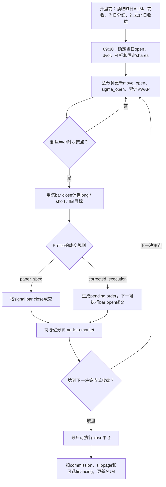
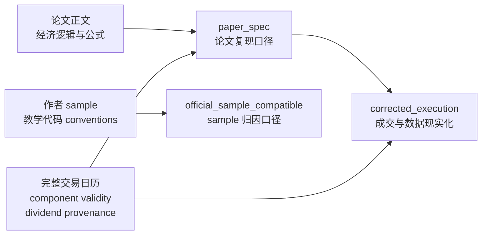

# SPY 日内动量策略：论文交易逻辑与本项目实现详解

- **面向读者：** 第一次接触本项目、不了解论文或分钟级回测的人
- **论文：** *Beat the Market: An Effective Intraday Momentum Strategy for S&P500 ETF (SPY)*
- **论文版本：** 2025-09-22 修订版，项目内文件 `Intraday-momentum.pdf`
- **项目实现：** `prepare_spy_data.py` 数据层 + `im_engine_v4.py` 三 profile 引擎
- **数据发布：** `data-v1.0`，明确覆盖 2008-01-22 至 2026-07-09
- **文档性质：** 交易规则与实现说明，不是正式投资建议，也不是 post-publication 经济评价报告

---

## 1. 一句话理解这套策略

这套策略试图判断：

> SPY 当前相对当日开盘的涨跌，是否已经大到超出过去 14 个交易日同一时刻的正常噪声范围，并且是否得到当日累计 VWAP 的确认。

如果价格同时突破“正常噪声上界”和 VWAP，就做多；如果同时跌破“正常噪声下界”和 VWAP，就做空；否则空仓。策略只在每半小时的固定时点重新决策，并在收盘前清空全部仓位，不持有隔夜风险。

论文最后再加入波动率定仓：

- 市场近期波动低时，可以提高名义仓位；
- 市场近期波动高时，自动降低名义仓位；
- 最大杠杆限制为 4 倍；
- 目标日波动率为 2%。

---

## 2. 为什么需要 band 和 VWAP

SPY 在一分钟尺度上存在大量随机波动。价格稍微上涨，并不一定代表出现了持续的买方力量；稍微下跌，也不一定代表卖方占据优势。

论文因此设置两层过滤：

1. **Noise Area / band：** 当前涨跌必须超过过去同一时刻通常会出现的波动；
2. **VWAP：** 当前价格还必须位于当日成交量加权平均价格的同一方向。

可以把它理解为：

```text
band 判断：这次移动是否足够大？
VWAP 判断：当日实际成交重心是否也支持这个方向？
```

只有两者同时确认，才持有方向性仓位。

---

## 3. 数据中的一根一分钟 bar 是什么

每根一分钟 bar 包含：

| 字段 | 含义 |
|---|---|
| `open` | 这一分钟的第一笔或代表性开盘价 |
| `high` | 这一分钟最高价 |
| `low` | 这一分钟最低价 |
| `close` | 这一分钟最后价 |
| `volume` | 这一分钟成交量 |

本项目的数据契约使用 **start-labelled bar**：

```text
09:30 timestamp = 09:30:00 至 09:30:59 这一分钟
09:59 timestamp = 09:59:00 至 09:59:59 这一分钟
```

`minute_of_session` 从 1 开始：

| `minute_of_session` | bar 标签 | bar 结束时刻 |
|---:|---|---|
| 1 | 09:30 | 09:31 |
| 30 | 09:59 | 10:00 |
| 60 | 10:29 | 10:30 |
| 360 | 15:29 | 15:30 |
| 390 | 15:59 | 16:00 |

因此，引擎在 `minute_of_session % 30 == 0` 时决策，对应论文所说的 10:00、10:30、11:00……15:30。16:00 只处理收盘，不允许新开仓。

明确 bar label 很重要。如果把 09:59 bar 错当成“从 09:58 到 09:59”，整个信号和成交时点会错一分钟。

---

## 4. 第一步：计算过去每一天相对开盘的移动

对于历史交易日 \(t-i\) 和某个固定时刻 \(m\)，论文定义：

\[
\operatorname{move}_{t-i,m}
=
\left|
\frac{C_{t-i,m}}{O_{t-i}}-1
\right|
\]

其中：

- \(C_{t-i,m}\)：历史日 \(t-i\) 在时刻 \(m\) 的 close；
- \(O_{t-i}\)：历史日 \(t-i\) 的真实开盘价；
- 绝对值表示这里只关心移动幅度，不区分上涨或下跌。

例如，某天开盘是 500，10:30 close 是 502：

\[
\left|\frac{502}{500}-1\right|=0.4\%
\]

如果另一天下跌到 498：

\[
\left|\frac{498}{500}-1\right|=0.4\%
\]

两天都贡献 0.4% 的历史噪声观察。

当前代码在 `im_engine_v4.build_features()` 中按每日第一根 bar 建立 `open_day`，再计算：

```python
move_open = abs(close / open_day - 1)
```

但只有 `move_open_obs_valid=True` 的观察才能进入历史。一个开盘数据缺失的交易日，即使下午还有价格，也不能把下午第一根可得 bar 冒充真实开盘。

---

## 5. 第二步：计算同一时刻过去 14 日的平均噪声

论文在每个时刻 \(m\) 单独计算：

\[
\sigma_{t,m}
=
\frac{1}{14}
\sum_{i=1}^{14}
\operatorname{move}_{t-i,m}
\]

这里的 \(\sigma_{t,m}\) 不是传统意义上的标准差，而是：

> 过去 14 个交易日，在同一时刻相对开盘的绝对移动平均值。

每个时刻有自己的 \(\sigma\)：

- 10:00 使用过去 14 个交易日的 10:00 观察；
- 12:30 使用过去 14 个交易日的 12:30 观察；
- 15:30 使用过去 14 个交易日的 15:30 观察。

通常越接近收盘，相对开盘的累计移动越大，因此 band 会随时间动态变化。

### 5.1 本项目的严格窗口

`paper_spec` 和 `corrected_execution` 使用严格的 14-session 窗口：

- 当前日不进入窗口；
- 只使用之前的交易日；
- 某日该 minute 缺失时，NaN 仍占据窗口槽位；
- 不向前寻找第 15 个、更老的有效观察来补足；
- 半日市未安排的下午 minute 不算“缺失”，该交易日本来就不是该 minute 的 eligible session；
- halt minute 不是正常观察，也不能进入后续 `sigma_open` 历史。

这避免把“过去 14 个交易日”静默改成“最近 14 个碰巧存在的数据行”。

### 5.2 作者 sample 的差异

作者公开 Python sample 使用：

```python
rolling(window=14, min_periods=13).mean().shift(1)
```

所以只要 13 个有效值就可能开始交易。项目把这个行为保留在：

```text
official_sample_compatible
```

但 `paper_spec` 按论文文字要求完整 14 个历史观察。

---

## 6. 第三步：构造动态 Noise Area / band

论文原始公式为：

\[
UB_{t,m}
=
\max(O_t,C_{t-1})
\times
(1+\sigma_{t,m})
\]

\[
LB_{t,m}
=
\min(O_t,C_{t-1})
\times
(1-\sigma_{t,m})
\]

其中：

- \(O_t\)：当日开盘价；
- \(C_{t-1}\)：前一交易日收盘价；
- \(UB\)：upper band；
- \(LB\)：lower band。

使用 `max()` 和 `min()` 的目的是把隔夜 gap 纳入噪声区间。

### 6.1 Gap-up

如果：

```text
昨日收盘 = 500
今日开盘 = 505
```

则：

```text
upper anchor = max(505, 500) = 505
lower anchor = min(505, 500) = 500
```

下界仍以昨日收盘为锚，避免仅凭隔夜高开就过早认定当日日内出现新的下行或上行动量。

### 6.2 Gap-down

如果：

```text
昨日收盘 = 500
今日开盘 = 495
```

则：

```text
upper anchor = 500
lower anchor = 495
```

上界保留昨日收盘锚点，把隔夜下跳包含在 Noise Area 中。

### 6.3 本项目的现金分红调整

当前项目实际使用：

\[
C_{t-1}^{adj}=C_{t-1}-D_t
\]

\[
UB_{t,m}
=
\max(O_t,C_{t-1}^{adj})
\times
(1+k\sigma_{t,m})
\]

\[
LB_{t,m}
=
\min(O_t,C_{t-1}^{adj})
\times
(1-k\sigma_{t,m})
\]

其中：

- \(D_t\)：当日 ex-date 的每股现金分红；
- \(k\)：`band_mult`，论文和默认实现均为 1。

这一步没有改写原始 OHLC，只调整策略使用的前收锚点。

需要特别说明：

- 论文 PDF 的 band 公式只写 \(C_{t-1}\)，正文没有明确讨论 dividend；
- 作者公开 Python sample 会从前收中减去当日分红；
- 当前 `paper_spec` 跟随作者代码的除息处理；
- 因此“分红调整”是作者代码意图与经济合理性支持的实现，不是论文正文逐字写出的规则。

如果不调整分红，除息日机械价格下移可能被误认为真实卖压。

---

## 7. 第四步：计算当日累计 VWAP

VWAP 是 Volume Weighted Average Price，即成交量加权平均价格。

论文明确 VWAP 只使用正常市场时段数据，但没有在正文中规定一分钟 bar 应使用 HLC3、OHLC4 还是成交级 VWAP。

作者 Python sample 和本项目默认都使用 HLC3：

\[
P_u^{HLC3}
=
\frac{H_u+L_u+C_u}{3}
\]

\[
VWAP_{t,m}
=
\frac{
\sum_{u=1}^{m}V_{t,u}P_{t,u}^{HLC3}
}{
\sum_{u=1}^{m}V_{t,u}
}
\]

这是一条从开盘开始、逐分钟累积的曲线，不是数据商提供的“单根 bar VWAP”。

### 7.1 为什么不能把 vendor bar VWAP 直接当累计 VWAP

单根 bar VWAP 只表示这一分钟内部的成交均价。论文策略使用的是：

```text
从开盘到当前时刻的累计成交重心
```

因此即使选择 `vendor_bar_vwap` 作为每根 bar 的价格代理，仍要用每分钟 volume 再做当日累计。

### 7.2 缺失 minute

如果 11:19 缺少一根正常应交易的 bar：

- 11:18 之前的 VWAP 仍可信；
- 11:19 开始累计路径不完整；
- 11:19 之后 `vwap_valid=False`；
- 不能用 forward fill 制造不存在的价格和成交量。

### 7.3 Halt

官方 halt minute 本来就没有正常连续成交，因此：

- halt minute 不参与累计成交量和累计 PV；
- vendor 即使保留零量 phantom bar，也不能把它当有效观察；
- halt 本身不会像普通数据缺失那样永久破坏复牌后的 VWAP；
- halt 内不允许产生信号或成交。

---

## 8. 第五步：生成多头、空头或空仓信号

当前最终信号为：

\[
Signal_{t,m}
=
\begin{cases}
+1, & C_{t,m}>UB_{t,m}\ \text{且}\ C_{t,m}>VWAP_{t,m}\\
-1, & C_{t,m}<LB_{t,m}\ \text{且}\ C_{t,m}<VWAP_{t,m}\\
0, & \text{其他情况}
\end{cases}
\]

也可以写成：

```text
close > max(upper_band, VWAP)  → long
close < min(lower_band, VWAP)  → short
其他                            → flat
```

### 8.1 为什么 `0` 很重要

`0` 不只是“没有新信号”，而是目标仓位为空仓。

例如已经持有多仓，下一决策点出现：

```text
close 仍高于 VWAP
但已经跌回 upper band 下方
```

此时信号变为0，引擎平掉多仓。

### 8.2 反手

如果多仓状态下，下一决策点直接满足空头条件：

```text
+1 → -1
```

这不是一单位成交，而是：

```text
卖出 N 股平多
再卖出 N 股建立空仓
合计交易 2N 股
```

因此 `0 → +1 → -1 → 0` 共计4个 traded units：

1. 开多：1；
2. 多翻空：2；
3. 平空：1。

---

## 9. 第六步：每日波动率与仓位大小

论文使用过去14个日收益的样本标准差：

\[
\mu_t
=
\frac{1}{14}
\sum_{i=1}^{14}r_{t-i}
\]

\[
\sigma^{daily}_t
=
\sqrt{
\frac{1}{13}
\sum_{i=1}^{14}
(r_{t-i}-\mu_t)^2
}
\]

分母是13，因此这是14个观察的样本标准差。

目标杠杆：

\[
L_t
=
\min
\left(
4,
\frac{0.02}{\sigma^{daily}_t}
\right)
\]

每日股数：

\[
Shares_t
=
\left\lfloor
\frac{
AUM_{t-1}\times L_t
}{
O_t
}
\right\rfloor
\]

其中：

- \(AUM_{t-1}\)：前一交易日结束后的账户权益；
- \(0.02\)：2%日波动目标；
- 4：最高4倍杠杆；
- floor 表示向下取整。

### 9.1 数值例子

假设：

```text
昨日 AUM = $100,000
今日开盘 = $500
过去14日样本波动率 = 1%
```

则：

\[
L_t=\min(4,2\%/1\%)=2
\]

\[
Shares_t
=
\left\lfloor
\frac{100000\times2}{500}
\right\rfloor
=400
\]

如果波动率升到4%：

\[
L_t=2\%/4\%=0.5
\]

\[
Shares_t=100
\]

所以同样的账户，在高波动环境下自动降低持仓。

### 9.2 历史窗口不能使用当天收益

在交易日 \(t\) 开盘时，当日收盘收益还不存在，因此只能使用：

```text
t-1 至 t-14
```

`dvol_lag=0` 会使用未来信息，当前引擎直接拒绝。

作者 sample 实际使用了 `d-15..d-2`，漏掉最近完成的 \(t-1\) 收益。本项目只在 `official_sample_compatible` 中保留这个偏差；`paper_spec` 和 `corrected_execution` 使用正确的 \(t-1..t-14\) 窗口。

### 9.3 波动率缺失

作者 sample 在波动率为 NaN 时使用最大4倍杠杆。这意味着“最不知道风险的时候承担最大风险”。

当前处理：

| Profile | 波动率缺失时 |
|---|---|
| `official_sample_compatible` | 保留作者行为，使用4× |
| `paper_spec` | 不交易 |
| `corrected_execution` | 不交易 |

---

## 10. 完整的日内交易时间线

下面以正常完整交易日为例：



### 10.1 决策与成交不是同一件事

策略需要当前 bar 的 close、band 和累计 VWAP，所以信号最早只能在该 bar 结束后确认。

本项目显式区分：

```text
signal time
→ order
→ intended fill time
→ actual fill
→ filled position
→ PnL
```

这比简单使用 `position.shift(1) * close.diff()` 更容易审计。

---

## 11. 三个 profile 分别回答什么问题

三个 profile 共用同一引擎、同一数据层，只在**假设**上分叉。先对照，再分述。

| 假设 | `official_sample_compatible` | `paper_spec` | `corrected_execution` |
|---|---|---|---|
| 复现对象 | 作者公开 notebook 的 conventions | 论文文字 + 作者明确意图 | 论文信号 + 诚实的成交路径 |
| sigma warm-up | 13 个值即可（sample 惯例） | 严格 14 个 eligible sessions | 严格 14 |
| 日波动率窗口 | `d-15..d-2`（sample 偏差，漏掉最近完成的一天） | `t-1..t-14`（`dvol_lag=1`） | `t-1..t-14` |
| NaN volatility | 4 倍杠杆 fallback（sample bug） | 不交易（skip） | 不交易 |
| 成交价 | 信号 bar close | 信号 bar close | **下一可执行 bar open** |
| 预定成交 minute 不可用 | queue 到可执行为止 | 取消订单 | 取消订单（可选 queue） |
| 滑点 | $0 | $0.001/share | $0.005/share |
| 佣金 | $0.0035/share、最低 $0.35/order | 同左 | 同左 |
| 每股成本（佣金+滑点） | 0.35¢ | 0.45¢ | 0.85¢ |
| 股数取整 | `round()` | `floor` | `floor` |
| 反手最低佣金 | 收两次（close + reverse 两笔单） | 一次（单笔 2N） | 一次（单笔 2N） |
| rolling 口径 | 按实际存在的数据行 | 严格 eligible slots：缺观测占槽，不向前补 | 同左 |
| 日收益有效性 | 用原始收盘 | 尊重 return validity，无效收盘按 unknown exit 处理 | 同左 |
| 分红文件缺失 | 容忍（sample 原本不调整） | 直接报错 | 直接报错 |
| 定位 | convention parity，不是 bit parity | 可归因的论文复现 | 最接近经济结果，非完整实盘 |

三个 profile 相同的部分：30 分钟信号频率、`band_mult=1`、2% 日波动目标、4 倍杠杆上限、HLC3 VWAP、全日历特征、最后才应用 tier mask、反手按两个 traded units 计费、EOD 平仓计入成交、AUM 只按净 PnL 变动。

全样本基线（零分红/零融资的 mechanics baseline）：official 17.0% CAGR / 1.15 Sharpe，paper_spec 16.8% / 1.16，corrected_execution 14.2% / 1.01（见 `PROJECT_WORK_LOG_ZH.md` §6）。三档差异几乎全来自成本与成交假设：把成交从信号 close 改成下一可执行 open、滑点从 0.1¢ 提到 0.5¢，年化掉约 2.6 个点——远大于任何 session tier 的影响。

### 11.1 `official_sample_compatible`

> 回答：作者公开 Python notebook 的结果是如何产生的。

它不是逐行 bit parity：交易日历、数据源、tier 与缺失数据处理、AUM 时间轴都是本项目的。因此只能称为 **convention parity**；真正的 parity 检验需要逐日对账 shares / signal / exposure / trade units / commission / gross / net / AUM，仅最终收益相等不算数。

### 11.2 `paper_spec`

> 回答：尽量按论文文字和作者明确意图复现，会得到什么。

需要谨慎理解的归因细节：

- 分红调整前收来自作者 sample，论文正文未写明；
- HLC3 VWAP 来自作者 sample，论文正文只规定 market-hours VWAP；
- `$0.35/order` 最低佣金来自作者 sample / 券商约定，论文正文只写每股费率；
- signal-bar-close 是对论文模糊成交描述的一种解释，不是原文唯一可能解释。

所以 `paper_spec` 是“可归因的论文复现 profile”，不是声称论文把所有工程细节都写全了。

### 11.3 `corrected_execution`

> 回答：保留论文信号，但只按现实中真正能成交的路径，会得到什么。

它是当前最接近经济结果的 profile，但仍不是完整实盘模型，因为：

- market impact 尚未完整建模；
- 融资和借券 time-integral 尚未完成；
- 没有排队位置模型；
- 固定每股滑点无法表达大订单参与率；
- 独立 daily benchmark 尚未接入。

---

## 12. 成交状态机如何工作

### 12.1 `paper_spec`

如果决策点目标仓位变化：

```text
当前bar close确认信号
→ 同一close价格执行目标仓位
```

这是论文复现约定，较为乐观。

### 12.2 `corrected_execution`

如果在 minute \(m\) 的 bar close 产生信号：

```text
pending target = signal
pending due = m + exec_lag_minutes
```

默认 `exec_lag_minutes=1`。

到下一个 minute：

- 如果该 minute 可执行：按 open 成交；
- 如果预定 minute 不可执行，且 policy 是 cancel：取消；
- 如果 policy 是 queue：等到第一个可执行 minute，按其 open 成交。

### 12.3 PnL归属

成交前的价格变化属于旧仓位。

例如：

```text
旧仓位 = 多头
下一bar open发生向下gap
随后在该open平仓
```

这个 gap 必须计入旧多仓，因为持仓者承担了风险。

相反，如果上一 bar 只产生了多头信号、尚未成交：

```text
复牌前没有仓位
→ 复牌gap不属于该订单
→ 在复牌open成交后才开始计算PnL
```

---

## 13. Halt / 熔断的处理

论文没有给出完整的 halt 状态机。本项目采用以下明确规则：

| 情况 | 是否承担复牌 gap |
|---|---|
| halt前已经持仓 | 是 |
| halt前产生信号，但订单到期时不可成交并被取消 | 否 |
| 订单选择queue到复牌 | 成交前否；复牌价成交后开始 |
| halt内出现计算上的方向条件 | 不允许决策 |

关键原则：

> “没有成交”不等于“已经持仓”；“halt期间没有bar”也不等于持仓没有风险。

当前数据层还会验证官方 halt minute 集合，防止：

- vendor 在 halt 内保留 phantom bar；
- halt 外缺失同样数量的正常 bar；
- 两者数量抵消后被错误判断为完整交易日。

---

## 14. 日终退出与未知退出

### 14.1 正常收盘

论文要求所有持仓在 market close 平掉，不留隔夜仓位。

正常完整交易日中：

- 15:59 start-labelled bar 在16:00结束；
- 现有仓位按最后可执行 close 平仓；
- EOD flatten 计入成交量和成本；
- 最后一根 bar 不允许新开仓或反手。

否则可能出现：

```text
16:00刚开仓
→ 同价立即平仓
→ PnL为0
→ 却扣两次成本
```

### 14.2 尾盘缺失

如果数据只到14:30，而策略仍持仓：

- 最后一根可得价格不等于真实收盘；
- 不能虚构16:00退出价；
- 该日标记为 `unknown_exit`。

默认 policy 是 `terminate`：

- 当日不进入 headline return；
- 猜测的退出PnL不进入AUM；
- 后续权益曲线停止，避免错误AUM继续影响未来股数。

其他 policy 只用于明确标记的敏感性分析。

---

## 15. 成本与账户核算

### 15.1 Gross PnL

每一段持仓的毛损益为：

\[
GrossPnL
=
Position
\times
(P_{new}-P_{old})
\times
Shares
\]

其中：

- 多仓 `Position=+1`；
- 空仓 `Position=-1`；
- 只有已经成交的仓位才产生 PnL。

### 15.2 Commission

每张订单：

\[
Commission
=
\max(
MinimumCommission,
CommissionPerShare\times Quantity
)
\]

默认：

```text
commission/share = $0.0035
minimum/order = $0.35
```

最低佣金是否在反手时收一次或两次，由 `reversal_order_model` 控制。

### 15.3 Slippage

\[
Slippage
=
SlipPerShare\times Quantity
\]

slippage 与 commission 分开累计，最低佣金不能吞掉 slippage。

默认值：

| Profile | Slippage/share |
|---|---:|
| `official_sample_compatible` | $0 |
| `paper_spec` | $0.001 |
| `corrected_execution` | $0.005 |

### 15.4 每日会计恒等式

\[
NetPnL
=
GrossPnL
-Commission
-Slippage
+CashInterest
-FundingCost
-BorrowCost
\]

\[
AUM_t=AUM_{t-1}+NetPnL_t
\]

当前正式 mechanics baseline 中现金、融资和借券 rate 默认均为0。

现有融资接口仍是近似版本。正式经济评价前，需要分别累计：

```text
positive_cash_time_integral
borrowed_cash_time_integral
long_notional_time_integral
short_notional_time_integral
```

不能用 `avg_signed_notional` 让同一天先多后空的风险相互抵消。

---

## 16. 为什么数据有效性是交易逻辑的一部分

一分钟策略中，数据缺失会改变信号定义，而不只是减少样本数量。

### 16.1 不能先删除坏日再计算特征

错误流程：

```text
只保留paper_ready交易日
→ 再计算previous close和14日rolling
```

这会造成：

- 次日 previous close 跨过被删除的交易日；
- 14日窗口变成“14个保留日”；
- 自然时间跨度被改变；
- 坏日的有效收盘无法用于次日前收；
- 缺失观察不再占窗口槽位。

正确流程：

```text
完整XNYS交易日历
→ 清洗后的全部有效bar
→ 组件级validity
→ 全日历历史特征
→ 配置相关signal mask
→ 最后应用session tier
```

### 16.2 核心 validity 字段

| 字段 | 含义 |
|---|---|
| `bar_present` | 计划中的该 minute 是否真的存在bar |
| `open_valid` | 当日真实开盘锚点是否存在且可信 |
| `close_valid` | 最后计划 minute 是否存在且可信 |
| `prev_close_valid` | 当日使用的前一交易日close是否可信 |
| `daily_ret_valid` | close-to-close日收益两端是否都有效 |
| `move_open_obs_valid` | 当日open和当前非halt bar是否都有效 |
| `vwap_valid` | 从开盘到当前minute的累计VWAP路径是否完整 |
| `is_halt_minute` | 是否属于官方halt |
| `is_executable_minute` | 当前minute是否真实可成交 |
| `sigma_history_valid` | 同minute历史窗口是否满足当前配置 |

### 16.3 一个 interior gap 的不同影响

假设11:19缺失：

```text
12:00 close存在
真实09:30 open存在
```

则：

- 12:00 `move_open` 仍能计算；
- 但11:19之后累计VWAP缺少成交量和价格路径；
- 因此12:00 `move_open_obs_valid=True`；
- 12:00 `vwap_valid=False`。

这说明不能用一个简单的“当天有效/无效”flag概括所有特征。

---

## 17. 三个 session tier

| Tier | 定位 | 应如何使用 |
|---|---|---|
| `paper_ready` | 所有计划分钟完整 | 论文完整数据基准和 sample convention 对照 |
| `halt_aware` | 完整日 + 只有官方halt分钟缺失的交易日 | 当前主要经济口径 |
| `exploratory` | 允许有限数据缺口 | 仅敏感性分析 |

每个 tier 都是一条不同的权益曲线。必须分别报告完整的：

- Total Return；
- CAGR；
- Volatility；
- Sharpe；
- MDD；
- Worst Day；
- Skew；
- Turnover；
- 成本。

不能使用：

```text
paper_ready的CAGR / halt_aware的MDD
```

因为这个 Calmar 比率不属于任何真实权益曲线。

---

## 18. 一个完整但简化的信号例子

以下数字只是教学例子，不是真实市场记录。

假设某日：

```text
当日open                         = 500.00
昨日close                       = 502.00
当日现金分红                    =   1.00
调整后previous close            = 501.00
过去14日该时刻平均move_open     =   0.30%
当前累计VWAP                    = 501.20
当前close                       = 502.70
```

Band：

\[
UB
=
\max(500,501)\times(1+0.003)
=502.503
\]

\[
LB
=
\min(500,501)\times(1-0.003)
=498.50
\]

当前 close：

```text
502.70 > upper band 502.503
502.70 > VWAP 501.20
```

所以：

```text
signal = +1
```

如果昨日AUM为 `$100,000`、过去14日样本波动率为1%，则：

```text
leverage = 2
shares = floor(100,000 × 2 / 500) = 400
```

在 `paper_spec` 中，目标是按信号 bar close 建立400股多仓。

在 `corrected_execution` 中：

```text
当前bar close产生long信号
→ 下一可执行bar open买入400股
→ 从实际成交价以后开始计算多仓PnL
```

---

## 19. 回测主循环的伪代码

```python
for day in complete_exchange_calendar:
    read previous_aum
    read day_open
    read adjusted_previous_close

    dvol = sample_std(previous_14_valid_daily_returns)
    if dvol is invalid:
        apply profile-specific nan-vol policy
    else:
        leverage = min(4, 0.02 / dvol)

    shares = floor(previous_aum * leverage / day_open)

    for minute in scheduled_minutes:
        compute move_open
        compute same-minute sigma_open from prior eligible sessions
        update cumulative VWAP

        if minute is a valid 30-minute decision:
            if close > upper_band and close > vwap:
                target = +1
            elif close < lower_band and close < vwap:
                target = -1
            else:
                target = 0

            route target through profile-specific execution

        mark the already-filled position to the next actual price

    flatten any known position at the scheduled close
    compute gross, commission, slippage and financing
    update AUM only with known net PnL
```

---

## 20. 论文、作者 sample 与当前实现：35项逐项对照

这一节完整覆盖 `PAPER_SAMPLE_CURRENT_COMPARISON_ZH.md` 中“逐项差异矩阵”的35个项目。项目名称和顺序与该矩阵一致，便于逐行审计。

需要先区分三种证据：

1. **论文明确规则**：论文正文、公式或参数表直接写明；
2. **作者sample convention**：公开Python sample实际执行的代码语义；
3. **当前项目规则**：`im_engine_v4.py`、`prepare_spy_data.py`与发布数据中的显式契约。

论文没有讨论的异常数据规则，不能写成“论文规定如此”。这类项目会明确标为“论文未系统说明”，当前处理属于防泄漏、可执行性或研究工程选择。



### 20.1 特征、窗口与价格锚点

#### 对照项1：同分钟噪声窗口

- **论文：** 对每个日内时刻，使用前14个交易日同一时刻的绝对开盘移动，计算 `sigma_open`。
- **作者sample：** 使用按现有数据行进行的rolling，并允许 `min_periods=13`；第13个可得观测后就可能产生band。
- **当前实现：** `paper_spec`和`corrected_execution`要求完整的14个eligible calendar slots；`official_sample_compatible`保留13个值即可和row-based rolling的sample convention。
- **为什么重要：** 13个值会提前一个session结束warm-up；按现有行rolling还会在某日该minute缺失时向前多取更老数据，改变论文“前14个交易日”的时间含义。

详细公式和缺失slot示例见第5节。

#### 对照项2：日波动率窗口

- **论文：** 当天定仓只能使用最近已经完成的14个交易日收益，即 \(t-1\) 至 \(t-14\)。
- **作者sample：** 实际切片对应 `d-15..d-2`，漏掉最近完成的 \(t-1\)，并多取一个更老session。
- **当前实现：** `paper_spec`和`corrected_execution`使用 `dvol_lag=1`；sample profile保留 `dvol_lag=2`。
- **为什么重要：** `dvol`直接进入 `target_vol / dvol`。窗口错一天不仅改变一个统计量，还会改变当天全部成交的股数和杠杆。

详细公式见第9节。

#### 对照项3：波动率缺失

- **论文：** 没有给出“14日波动率无法计算时如何交易”的明确fallback；从风险定仓逻辑看，此时不存在可靠的仓位依据。
- **作者sample：** NaN volatility落入最大杠杆fallback，等价于在风险信息最不足时使用4倍杠杆。
- **当前实现：** `paper_spec`和`corrected_execution`的 `nanvol_action="skip"`，不交易；sample profile保留 `max_lev` 以复现作者convention。
- **为什么重要：** 这是风险方向相反的选择。缺失风险估计不应被解释成“风险很低”。

#### 对照项4：Previous close

- **论文：** band公式使用前一交易日收盘价作为锚点；论文正文没有完整定义坏日、缺失收盘和除息日的工程处理。
- **作者sample：** 从现有数据构造前收，并对现金分红作简化扣减。
- **当前实现：** previous close来自完整exchange calendar上的上一session；只有上一session的 `close_valid=True` 才可作为锚点，再形成 `prev_close_adj = prev_close - dividend_t`。
- **为什么重要：** 如果先删除坏日再shift，所谓“前收”可能实际是两天前或更早的收盘，upper/lower band都会被错误移动。

#### 对照项5：分红

- **论文：** 正文公式没有明确写出现金分红调整步骤。因此不能声称论文文字逐字规定“减当日分红”；但除息会机械性改变未复权前收与当日开盘的可比性。
- **作者sample：** 策略band锚点会扣除当日分红，但benchmark通常没有同样完整的total-return处理。
- **当前实现：** 默认要求有可追溯的clean dividend文件；band使用除息调整前收，benchmark同时报告price return和total return。也允许显式 `ignore_dividends`，但必须记录，不能静默忽略。
- **为什么重要：** 不调整会把除息造成的机械价格跳空误认为交易信号；benchmark漏分红则会高估策略相对SPY的超额收益。

State Street分红来源和band调整公式见第6.3节。

### 20.2 交易日历与component validity

#### 对照项6：半日市

- **论文：** 只要求在市场实际开放时交易，没有给出半日市数据工程细节。
- **作者sample：** 主要依赖输入中实际存在的rows；若把正常提前收盘后的分钟补成“缺失”，容易误判数据质量。
- **当前实现：** 使用XNYS scheduled grid。半日市的 `calendar_bars` 本来就更短，正常收盘后的下午不属于计划交易分钟，也不会被算作gap或truncation。
- **为什么重要：** “计划中不存在”与“应该存在但缺失”是两种完全不同的状态，后者才应使组件失效。

#### 对照项7：整日缺失

- **论文：** 没有系统说明整日无bar时rolling如何处理。
- **作者sample：** 整日缺失通常意味着DataFrame中完全没有该session；rolling会直接跨过它。
- **当前实现：** daily母表由完整 `vsess` 交易日历驱动。无bar的session仍保留一行NaN，并占据14-session窗口的一个slot。
- **为什么重要：** 若整日缺失直接消失，窗口会向前抓取更老session，产生看不见的样本替换和潜在时间轴压缩。

#### 对照项8：Interior gap

- **论文：** 未系统定义盘中缺少一分钟或连续多分钟时各特征是否仍有效。
- **作者sample：** 通常在剩余rows上继续累计VWAP和rolling，不暴露依赖已经断裂。
- **当前实现：** component validity分别管理依赖。gap之后的累计 `vwap_valid=False`；但某一后续minute的 `move_open_obs_valid` 可在open锚点和该bar本身都有效时独立成立。
- **为什么重要：** VWAP依赖从开盘到当前的完整累计路径，而 `move_open` 只依赖当日open和当前close。用一个总flag会错误地让两者一起有效或一起失效。

见第16.3节的依赖拆分示例。

#### 对照项9：Truncated open

- **论文：** 默认当日开盘锚点真实存在，没有说明开盘部分缺失如何补救。
- **作者sample：** 第一根可得bar可能被当作当日open，即使它实际来自09:37或更晚。
- **当前实现：** 一旦计划开盘bar缺失，`open_valid=False`，当日全部 `move_open_obs_valid=False`；真实收盘若存在，`close_valid`仍可独立为True。
- **为什么重要：** 把09:37价格冒充09:30开盘会污染当日所有开盘移动，并进一步污染未来14日同minute的band历史。

#### 对照项10：Trailing truncation

- **论文：** 策略在日终清仓，并默认能观察到真实退出价和真实收盘。
- **作者sample：** 容易把当天最后一根可得bar当作收盘，即使数据在15:42已经中断。
- **当前实现：** 尾盘截断使 `close_valid=False`。若策略在数据中断时仍有仓位，则标记 `unknown_exit`；无效close也不会进入benchmark。
- **为什么重要：** 最后一根可得bar不等于真实收盘价。用它平仓会制造不可验证PnL，并污染下一日previous close、benchmark及后续AUM。

#### 对照项11：Halt minute

- **论文：** 没有给出逐分钟order/fill状态机；经济上halt期间不可成交，已有仓位仍承担复牌跳空。
- **作者sample：** shifted-row exposure没有区分“已经持仓”和“信号出现但订单尚未成交”，可能把复牌gap错误给未成交订单。
- **当前实现：** halt minute不允许决策和成交，也不进入VWAP或mark path；halt前已有仓位获得完整复牌gap，未成交订单在默认cancel policy下什么也不赚。
- **为什么重要：** “没有可执行bar”不代表持仓风险停止，也不代表新订单已经成交。

完整状态转换见第13节。

### 20.3 信号时点、订单与成交

#### 对照项12：决策频率

- **论文：** 每30分钟在HH:00和HH:30重新判断方向，收盘只负责清仓。
- **作者sample：** 依赖 `min_from_open` 或现有分钟编号，每30格处理一次。
- **当前实现：** `config_validity()`按当前 `Cfg.trade_freq` 在scheduled、start-labelled minute grid上重建15/30/60分钟等决策网格。
- **为什么重要：** 如果直接消费数据层按默认30分钟预先生成的mask，参数改成15分钟后仍可能只在30分钟决策，形成“配置写了但没有生效”的静默错误。

minute label到时钟时间的映射见第3节和第10节。

#### 对照项13：Signal validity

- **论文：** 信号要求当时所需输入可得，但没有软件层validity字段。
- **作者sample：** 有效性主要隐含在DataFrame操作和NaN传播中。
- **当前实现：** 数据层只发布parameter-free primitives；引擎用当前配置组合 `trade_freq`、`sigma_window`、VWAP开关、dvol需求、前收有效性和可执行分钟，生成config-specific decision mask。
- **为什么重要：** validity必须随配置变化。固定的 `signal_valid_default_config` 只能诊断默认参数，不能用于参数扫描或其他profile。

#### 对照项14：Signal时点

- **论文：** 用一个bar结束时已经观察到的close、band和VWAP确认信号。
- **作者sample：** 在signal bar生成方向，再用shifted exposure近似下一行持仓；“信号”和“成交”没有独立对象。
- **当前实现：** 三profile都先在signal bar close后生成target；`paper_spec`立即按该close记成交，`corrected_execution`只创建pending order，等待下一可执行open。
- **为什么重要：** 信号确认时间与成交时间必须分开。否则容易让仓位获得用于生成信号的同一bar内部收益。

#### 对照项15：成交价格

- **论文：** 文字允许把信号bar close当成交价，但这是乐观且存在解释空间的复现口径。
- **作者sample：** shifted close exposure近似signal-bar-close之后持仓，不是实际open成交模型。
- **当前实现：** `paper_spec.fill_price="signal_bar_close"`保留论文乐观口径；`corrected_execution.fill_price="next_executable_open"`在下一可执行bar的open成交。
- **为什么重要：** 从signal close到next open的价格变化只有在signal close真实成交后才属于新仓位。现实化profile不把这段变化免费送给策略。

#### 对照项16：Pending order

- **论文：** 没有规定信号后下一minute不可交易时订单取消还是排队。
- **作者sample：** 没有真正pending状态；按下一可得data row shift，可能隐式排队到复牌并获得不应属于订单的gap。
- **当前实现：** 状态机显式记录 `pending` 和 `pending_due`。默认 `cancel_if_next_unavailable`；敏感性分析可选择 `queue_until_executable`，但必须披露。
- **为什么重要：** cancel和queue是不同交易规则，会改变成交数量、复牌风险和成本，不能由DataFrame缺行行为偶然决定。

#### 对照项17：最后一根bar

- **论文：** 日终必须平仓，因此最后计划bar不应再新开随后立即平掉的仓位。
- **作者sample：** row shift因为没有下一行，副作用上避开了部分尾盘新仓，但没有显式规则。
- **当前实现：** 当 `minute_of_session == calendar_bars` 时禁止新开或反手；只执行已有仓位的EOD flatten。
- **为什么重要：** 否则会产生同价开仓、同价平仓的零gross PnL round trip，却收两边成本和turnover。

#### 对照项18：`exec_lag>1`

- **论文：** 主要讨论紧邻信号的成交，没有重点定义多分钟延迟。
- **作者sample：** 单行shift不支持通用lag。
- **当前实现：** `pending_due = signal_minute + exec_lag_minutes`；状态机显式区分当前minute小于、等于或已经越过due minute。越过后按policy取消或排队成交。
- **为什么重要：** 只判断“当前minute是否不小于due”会在缺分钟或halt时提前/错误成交；必须知道due slot是否实际可执行。

#### 对照项19：股数舍入

- **论文：** 仓位公式对应向下取整 `floor`，避免超过目标名义敞口。
- **作者sample：** 使用 `round`，可能向上增加一股。
- **当前实现：** `paper_spec`和`corrected_execution`使用 `floor`；sample profile使用 `round`，并由配置字段使用审计确认该参数真的进入下单股数。
- **为什么重要：** 单次一股差异通常很小，但会影响逐日parity、commission阈值和长期AUM路径；不能为了最终收益接近而混用。

#### 对照项20：反手

- **论文：** 从多头变为空头或从空头变为多头，经济上必须先平旧仓再建立等量反向仓位。
- **作者sample：** 用position change概念近似，但教学实现没有完整订单事件账本。
- **当前实现：** target从 \(+1\) 到 \(-1\) 时 `delta=2`，成交股数为 \(2N\)。序列 \(0\to+1\to-1\to0\) 是3次fill event、4个trade units。
- **为什么重要：** 若把反手计成1单位，会同时少算一半反手turnover、commission和slippage。

见第8.2节和第15节。

### 20.4 成本、会计与持仓归属

#### 对照项21：Commission

- **论文：** 经核对的正文明确给出约 `$0.0035/share`；正文是否同时明确规定 `$0.35/order` 最低佣金并不充分，因此报告不能把最低值写成无歧义论文原文。
- **作者sample：** 使用每股佣金并施加 `$0.35/order` 最低值。
- **当前实现：** `Cfg.comm_per_share=0.0035`、`min_comm=0.35`；按实际成交quantity收费。反手可配置为单张 \(2N\) 订单或两张 \(N\) 订单，最低佣金相应应用一次或两次。
- **为什么重要：** 小订单主要由minimum commission决定；反手订单拆分方式也会改变成本。论文每股费率、sample最低值和当前订单模型必须分开归因。

#### 对照项22：Slippage

- **论文：** 明确使用约 `$0.001/share` 的滑点假设。
- **作者sample：** 公开教学代码通常没有从PnL中扣除该滑点。
- **当前实现：** sample profile为0；`paper_spec`为0.001美元/股；`corrected_execution`默认0.005美元/股。slippage与commission分列，不受minimum commission影响。
- **为什么重要：** 这直接解释sample、paper和corrected结果的部分阶梯式下降，也便于以后单独替换成交成本模型。

#### 对照项23：Market impact

- **论文：** 没有完整建模订单规模对成交价格的非线性影响。
- **作者sample：** 没有impact或容量约束。
- **当前实现：** 尚未实现；当前固定per-share slippage不会随AUM、股数、ADV、波动率或参与率上升。
- **为什么重要：** 当AUM或杠杆增大时，固定滑点通常过于乐观。因此当前 `corrected_execution`仍是完整实盘成本前的上限估计，不是容量结论。

#### 对照项24：现金/融资/借券

- **论文：** 经济上杠杆多头需要融资，空头需要borrow，闲置正现金可能获得利息，但论文回测没有完整的分钟time-integral账户。
- **作者sample：** 基本忽略这些现金流。
- **当前实现：** 已有 `cash_rate_annual`、`funding_rate_annual`、`borrow_rate_annual` 接口和基础现金账户；但当前 `avg_signed_notional` 会让同日多空notional相互抵消，尚未分别累计正现金、借入现金、多头和空头敞口。
- **为什么重要：** 4倍多头约有3倍AUM的借入现金，空头还涉及borrow fee。用净signed notional可能低估两边都发生时的真实成本。

#### 对照项25：PnL marking

- **论文：** 以持仓期间价格变化形成PnL，但没有给出halt和pending order下的逐事件归属算法。
- **作者sample：** 使用shifted exposure乘close difference，价格变化按数据行而不是可执行事件归属。
- **当前实现：** 每次fill前先把旧仓从last mark标记到fill price；成交后新仓才从该fill price开始承担后续变化。halt前已有仓位获得复牌gap，尚未成交的target不获得。
- **为什么重要：** PnL必须属于价格变化发生时已经存在的仓位，而不是事后看到信号的目标仓位。

#### 对照项26：Unknown exit

- **论文：** 假定日终可以清仓，没有系统定义真实尾盘价格未知时怎么办。
- **作者sample：** 使用最后可得bar，容易把猜测当真实退出。
- **当前实现：** 支持 `terminate`、`exclude_session_and_freeze_aum`、`impute_last_observed` 三种policy，默认 `terminate`。headline不纳入unknown-exit session，猜测PnL不会进入后续AUM复利。
- **为什么重要：** 一次虚假退出不只影响当天收益，还会改变之后每天的position size；默认终止是最保守且最可审计的处理。

#### 对照项27：Session filtering

- **论文：** 通常在可用数据样本上展示结果，没有讨论多个数据质量tier。
- **作者sample：** 在当前DataFrame现有sessions上直接计算并交易。
- **当前实现：** 先在完整exchange calendar上计算previous close、`sigma_open`、`dvol`等特征，最后才用 `paper_ready`、`halt_aware`或`exploratory`作为交易mask。
- **为什么重要：** 若先删除某tier不交易的坏日，再计算特征，后续“好日”的previous close和rolling历史也会改变，形成隐蔽的样本重定义。

见第16.1节和第17节。

### 20.5 VWAP、benchmark与统计

#### 对照项28：VWAP

- **论文：** 要求使用当日从开盘累计到当前时刻的market-hours VWAP，但没有明确指定每分钟价格代理。
- **作者sample：** 使用HLC3，即 `(high + low + close) / 3`，再按volume累计。
- **当前实现：** 默认 `vwap_source="hlc3"`；也可显式选择 `ohlc4` 或 `vendor_bar_vwap`。无论代理如何，都会重新计算日内累计值；halt minute不进入累计，interior gap后validity失效。
- **为什么重要：** 数据商每bar VWAP不是论文所说的“从开盘累计VWAP”；不同价格代理也属于必须披露的实现选择。

完整公式见第7节。

#### 对照项29：Benchmark

- **论文：** 报告SPY Buy & Hold；论文表格更接近raw-price benchmark，未必包含完整现金分红total return。
- **作者sample：** 通常直接对价格做收益，可能遗漏分红、无效close和evaluation首日anchor。
- **当前实现：** 同时计算SPY price return与total return；无效close保留NaN；evaluation开始前引入一个有效close anchor；策略与benchmark使用相同session时间轴。
- **为什么重要：** 漏分红会高估策略excess；首日无anchor会让策略首日交易但benchmark首日收益静默为0；用截断bar冒充close会污染alpha和beta。

见第21节。

#### 对照项30：Sharpe

- **论文：** 应在一致的收益时间轴上年化。
- **作者sample：** 若只保留active或有收益的sessions，再乘 \(\sqrt{252}\)，可能人为抬高Sharpe。
- **当前实现：** headline使用calendarised return，包括评价窗口内的flat day；active sessions只报告未年化conditional mean/std，不另造一个active annualised Sharpe。
- **为什么重要：** 删除不交易日后仍按252年化，相当于既压缩时间轴又保留全年频率，会制造不可比较的高Sharpe。

#### 对照项31：CAGR

- **论文：** CAGR应反映真实日历时间。
- **作者sample：** 若按保留下来的收益行数量除以252，删除坏日会把时间压缩。
- **当前实现：** 总复利使用评价session收益，但年数按首末日期差除以365.2425计算。
- **为什么重要：** 同样的累计收益不能因为删掉若干无效session就假装在更短时间内完成。

#### 对照项32：MDD

- **论文：** 最大回撤来自一条定义一致的权益曲线。
- **作者sample：** 主要使用EOD equity，但未系统区分数据tier。
- **当前实现：** 每个profile与tier独立生成完整指标，MDD只来自该组合自己的calendarised equity curve；禁止从不同tier拼接CAGR、MDD或Calmar。
- **为什么重要：** 一个tier的收益与另一个tier的回撤没有共同权益路径，混合后的风险收益比没有数学定义。

#### 对照项33：Alpha/Beta

- **论文：** 需要策略和SPY对齐收益；严谨推断还应考虑时间序列相关与稳健标准误。
- **作者sample：** 通常是简单OLS或等价点估计，输入benchmark也常是price return。
- **当前实现：** 在对齐的SPY total-return sessions上计算beta和年化alpha点估计；v2明确延期HAC标准误和置信区间，当前报告不得暗示已提供统计置信区间。
- **为什么重要：** 点估计可以描述样本关系，但没有稳健误差就不能判断alpha是否统计显著；分钟文件自身的close缺陷也可能同时影响回归两边。

### 20.6 可复现性与验证

#### 对照项34：数据审计

- **论文：** 数据工程不是论文重点，读者通常只能接受作者所用IQFeed样本。
- **作者sample：** 依赖输入文件，没有完整发布manifest、hash和异常证据链。
- **当前实现：** 数据发布记录source hash、依赖锁、expected/observed边界、异常reports、manifest、`_SUCCESS`和Git commit；atomic publish避免半成品被当作成功run，latest pointer只指向完整发布。
- **为什么重要：** 同名文件不代表同一数据。没有边界、hash和成功标记，就无法证明两次回测使用了同一个输入，也无法区分零异常与审计文件缺失。

#### 对照项35：测试

- **论文：** 没有公开覆盖这些工程语义的完整自动测试矩阵。
- **作者sample：** 主要是教学与结果展示代码，不以生产级回归检查为目标。
- **当前实现：** 截至本报告版本有62项engine checks与28项data self-tests，覆盖窗口、halt、订单、反手、成本、参数生效、unknown exit、benchmark anchor和不可变发布读取等。
- **为什么重要：** 测试的目标不是证明策略赚钱，而是防止代码修改静默改变策略定义、配置字段只声明未使用，或正式发布与普通run读取结果漂移。

当前验证边界和Q24独立复现实验见第23节。

---

## 21. Benchmark 与策略收益不是同一件事

策略收益回答：

> 交易规则本身赚了多少？

Benchmark 回答：

> 与长期持有SPY相比，是否有超额收益？

当前引擎计算：

- SPY price return；
- SPY total return；
- excess CAGR；
- beta；
- annualised alpha；
- information ratio。

处理原则：

- invalid close 是 NaN，不能用最后可得bar冒充收盘；
- evaluation首日前增加一个有效close anchor；
- `pct_change(fill_method=None)`，不自动填补；
- strategy和benchmark使用相同session时间轴；
- benchmark total return使用同一分红文件。

论文表中的 SPY Buy&Hold 更接近 raw-price benchmark。当前经济比较以 total return 为主要基准，因此 benchmark、alpha和excess不应直接宣称与论文表格逐项相同。

正式报告仍建议接入独立 daily SPY raw-close 数据，因为分钟文件若缺少真实尾盘，无法恢复当天真正的收盘价。

---

## 22. 统计指标如何解释

### Total Return

\[
TotalReturn
=
\prod_t(1+r_t)-1
\]

### CAGR

按首末实际日期的年数计算，而不是用保留下来的收益行数假设经过了多少年。

### Volatility

完整evaluation session日收益的样本标准差乘 \(\sqrt{252}\)。

### Sharpe

\[
Sharpe
=
\frac{
\overline r-r_f/252
}{
s_r
}
\sqrt{252}
\]

主指标是 `Sharpe_calendar`。没有仓位或没有信号的交易日仍留在日历时间轴上。

不能只选择有交易的日收益再直接乘 \(\sqrt{252}\)，否则会机械抬高 Sharpe。

### Maximum Drawdown

从同一条复利权益曲线计算峰值到后续谷值的最大跌幅。

### Hit Ratio

当前 headline `Hit%` 是非零日收益中正收益日的比例。论文另有 trade-level hit ratio，两者不能混用。

---

## 23. 当前验证证据

截至本文编写时，项目记录的验证包括：

- `python test_engine.py`：62项引擎检查；
- `python prepare_spy_data.py --self-test`：28项数据层检查；
- 不可变 `data-v1.0` 与普通pipeline run的等价加载检查；
- halt持仓与未成交订单的复牌gap测试；
- 反手quantity、commission和slippage测试；
- 14-session warm-up和缺失slot测试；
- dividend band adjustment测试；
- `trade_freq`、`sigma_window`、`use_vwap`、`sizing`参数真实生效测试；
- final-bar round-trip防护；
- unknown exit不污染AUM；
- benchmark首日anchor和invalid close处理；
- Cfg字段使用审计，防止参数只声明但未被代码读取。

论文Q24独立复现实验运行：

```text
3 profiles
× 3 tiers
× 2 dividend modes
= 18 cells
```

其中：

```text
paper_spec × halt_aware × with_dividends
```

在严格可比的206个月中，月收益平均绝对误差为0.3059个百分点；忽略分红时为0.3539个百分点。这个结果支持当前 band 分红调整和 halt-aware 口径，但不能证明逐行 bit parity：

- 当前数据源不是论文的IQFeed；
- 当前数据从2008-01-22开始，论文从2007年5月开始；
- primary组合是在初步观察后登记的诊断组合，不是盲预注册；
- 部分月份仍存在明显差异。

该实验只用于论文复现诊断，不是正式 post-publication 经济评价。

---

## 24. 当前实现仍然缺少什么

即使 `corrected_execution` 比论文回测更现实，也仍然不是完整实盘模拟。

尚未完成：

1. 完整signals / orders / fills / round-trip ledger；
2. 正现金、借入现金、多头notional、空头notional的独立time-integral；
3. 完整融资和short borrow成本；
4. 依订单规模、ADV、波动率和参与率变化的market impact；
5. 排队位置和部分成交模型；
6. 独立daily SPY raw-close benchmark；
7. 唯一的可执行evaluation runner；
8. bootstrap/HAC等统计不确定性明确延期；v2只报告点估计；
9. 冻结后的唯一post-publication正式报告。

因此：

> `corrected_execution` 是比论文复现更诚实的历史模拟，但仍应视为完整实盘成本前的上限估计。

---

## 25. 阅读项目结果时应使用哪个组合

### 作者 sample 归因

```text
official_sample_compatible × paper_ready
```

用于理解作者 notebook 的主要约定，不用于实盘结论。

### 论文完整数据复现基准

```text
paper_spec × paper_ready
```

用于回答严格完整分钟数据下的论文规则表现。

### Q24 月收益诊断

```text
paper_spec × halt_aware × with_dividends
```

当前与论文2025-09-22修订版Q24月表最接近，但属于已披露的观察后诊断选择。

### 当前主要经济口径

```text
corrected_execution × halt_aware × with_dividends
```

仍需加入完整融资、借券、market impact和独立benchmark后，才能形成最终经济结论。

---

## 26. 最容易产生误解的十句话

### 误解1：“突破upper band就做多”

不完整。最终策略还要求价格高于VWAP。

### 误解2：“VWAP是vendor提供的每分钟VWAP列”

不正确。策略使用从开盘到当前minute的累计VWAP。

### 误解3：“过去14日就是最近14个有效值”

不正确。缺失观察占槽位，不能向前找更老数据补足。

### 误解4：“没有bar的halt期间没有PnL”

不正确。已有持仓承担复牌gap，只是不虚构halt内逐分钟价格。

### 误解5：“信号出现就已经持仓”

不正确。`corrected_execution` 必须等下一可执行open真实成交。

### 误解6：“反手是一笔一单位交易”

不正确。多翻空或空翻多需要2N股成交量。

### 误解7：“最后一根可得bar就是收盘价”

不正确。尾盘截断时真实收盘未知。

### 误解8：“只删除坏日，不会改变好日结果”

不正确。previous close、14日band和dvol都会被重新定义。

### 误解9：“论文结果等于可实盘结果”

不正确。论文的成交、融资、借券和impact假设仍偏简化。

### 误解10：“全样本CAGR高就说明策略现在有效”

不正确。真正的研究问题是2024-05-01以后：

```text
gross edge per traded share
是否仍高于
execution + financing + borrow + impact cost per traded share
```

---

## 27. 代码与资料导航

| 文件 | 什么时候读 |
|---|---|
| `Intraday-momentum.pdf` | 查看论文原文、公式、图表和Q24 |
| `PAPER_SAMPLE_CURRENT_COMPARISON_ZH.md` | 逐项查看论文、作者sample和当前实现差异 |
| `README_DATA.md` | 理解数据发布、validity、tier和halt语义 |
| `README_ENGINE.md` | 理解三profile、状态机、成本和统计 |
| `../prepare_spy_data.py` | 数据检查、交易日历、component validity |
| `../im_engine_v4.py` | 特征、信号、定仓、订单、PnL和报告 |
| `../test_engine.py` | 引擎行为的合成回归检查 |
| `../config/evaluation_spec_v1.yml` | 冻结的post-publication评估规则 |
| `../config/data_release_v1.yml` | data-v1.0边界和环境契约 |
| `../experiments/paper_replication_v1/README.md` | Q24月收益独立复现实验 |

关键代码入口：

```text
im_engine_v4.Cfg
im_engine_v4.profile_cfg
im_engine_v4.load_run
im_engine_v4.build_features
im_engine_v4.config_validity
im_engine_v4._session_pnl
im_engine_v4.backtest
im_engine_v4.stats
im_engine_v4.benchmark
im_engine_v4.report
```

---

## 28. 当前交易执行口径与待验证假设

本节记录当前代码中“信号何时产生、用什么价格建仓、订单未成交如何处理、
尾盘如何平仓，以及成本如何进入收益”的精确定义。需要区分：

- **冻结实现**：已经进入正式 v2 结果、不能根据结果倒推修改；
- **经济解释**：用于判断正式结果是否接近可交易现实；
- **后续敏感性实验**：应写入新的配置和输出路径，不能覆盖冻结结果。

### 28.1 信号时点与建仓价格

信号在 minute bar `t` 的 **close 已知后**计算。三个 profile 的成交约定不同：

| profile | 当前建仓/调仓价格 |
|---|---|
| `official_sample_compatible` | 信号 bar 的 close，即 \(C_t\) |
| `paper_spec` | 信号 bar 的 close，即 \(C_t\) |
| `corrected_execution` | 默认延迟 1 分钟，在计划成交 minute 的 open 成交，即 \(O_{t+1}\) |

因此，正式经济口径 `corrected_execution`：

- 不是用前一分钟 close 建仓；
- 不是直接使用信号 bar close；
- 正常情况下使用下一分钟 bar 的 open；
- 持仓 PnL 从这个实际 fill 以后开始计算。

可写成：

```text
bar t close 可见
→ 计算 signal_t
→ 创建 intended minute = t + 1 的 pending order
→ 若 t+1 可执行，以 open[t+1] 成交
→ 成交后才拥有 position
```

账本中的 `fill_price` 保留原始 bar open。固定每股滑点不通过修改
`fill_price` 实现，而是作为独立现金成本扣除。因此“账本成交价”和“包含滑点后的
经济成交价”不能混为一列。

### 28.2 Pending order、缺失 minute 与 halt

`corrected_execution` 当前默认：

```text
exec_lag_minutes = 1
pending_order_policy = cancel_if_next_unavailable
```

具体语义如下：

1. 如果计划成交 minute `t+1` 可执行，订单按该 minute 的 open 成交；
2. 如果 `t+1` 不可执行，而后续首先遇到的是更晚的 minute，默认取消订单，
   原因记为 `intended_minute_unavailable`；
3. `queue_until_executable` 仅作为替代规则：订单在恢复交易后的第一个
   executable open 成交；
4. 无论 cancel 还是 queue，未成交订单都不能获得信号 close 到复牌 open
   之间的跳空收益；
5. 已在 halt 前成交并持有的仓位必须完整承担或获得复牌跳空。

从经济语义看，`halt_aware` 比把已核实 halt 日全部排除的 `paper_ready`
更接近真实持仓路径。但正式 v2 headline 已冻结为 `paper_ready`，不能回改；
`halt_aware` 应作为主要经济解释和敏感性结果并列报告。

当前正式 v2 的代表性账本没有发生 pending cancellation，因此
`cancel_if_next_unavailable` 与 `queue_until_executable` 并未改变该次正式结果。
这不代表两者在未来数据或实时交易中等价。更稳健的后续规则是：订单过期即取消，
复牌后重新计算新信号；queue 继续作为敏感性场景。

### 28.3 EOD flatten 的价格代理及限制

当前代码在日末仍有仓位时，使用：

```text
最后一个 executable minute bar 的 close
```

进行强制平仓。完整交易日通常对应 **15:59 minute bar close**。它不是：

- 交易所官方 closing auction 成交价；
- 独立日线 official close；
- 对收盘集合竞价冲击和排队的模拟。

当前 closing 的完整操作规则是：

| 项目 | 当前实现 |
|---|---|
| 触发条件 | 当日 minute 循环结束后仍有非零持仓 |
| 正常日平仓价 | 15:59 minute bar 的 close |
| 更精确的代码定义 | 当日最后一个 executable minute bar 的 close |
| 15:59 缺失或不可执行 | 使用更早的最后一个 executable close，同时暴露为 unknown-tail 风险；不能把该价格解释成真实收盘成交价 |
| 当日完全没有 executable bar | 没有可用 EOD fill price，不能虚构成交 |
| 未成交的 pending order | 在 session 结束时取消，不能与旧仓位的 EOD flatten 混为一笔 |
| 最后一根计划 bar 的新信号 | 不建立新仓，避免在同一价格立刻开仓再平仓并重复收费 |
| 订单标识 | 记为 `end_of_session` |
| 平仓成本 | 按实际平仓股数收取佣金和所选 per-share slippage |
| 平仓后状态 | position 归零；当日 gross PnL 计到该 close，成本独立扣除 |

上述规则适用于引擎的 EOD 强制归零逻辑；不同 profile 的日内建仓价虽然不同，
都不能把隔夜仓位带到下一交易日。

因此当前 EOD fill 只是分钟数据约束下的代理。尾盘 minute 缺失时，
“最后一个可得 close”更不能自动解释为真实可成交收盘价；未知尾部还可能使
当日退出和后续 AUM 路径失去可靠性。

EOD flatten 在成交量和策略 PnL 中占比不可忽略，所以后续应单独实验：

1. 当前 `15:59 close + intraday slippage`；
2. official daily close 作为 MOC 价格代理，并另加 auction cost；
3. 尾盘 VWAP/TWAP 执行。

这些实验必须重算完整持仓、成本和 AUM 路径，不能只在冻结账本上静态替换价格后
宣称得到新的 CAGR。

### 28.4 每股成本与滑点网格

论文口径佣金为：

```text
$0.0035/share = 0.35¢/share
```

`corrected_execution` 当前默认滑点为 `$0.005/share`，所以不考虑最低佣金
对小订单的额外影响时：

```text
commission 0.35¢ + slippage 0.50¢ = 0.85¢/traded share
```

这里的 **0.85 是美分，不是 0.85 美元**。反手会先平旧仓再开新仓，成交股数和
成本都按两个方向累计。

`$0.001 / $0.0025 / $0.005` 不应被描述成已经由本项目数据估计出的唯一真实滑点。
更合适的解释是：

| 滑点 | 用途 |
|---|---|
| `$0.001/share` | 偏乐观、接近论文摩擦假设的场景 |
| `$0.0025/share` | 中间场景 |
| `$0.005/share` | 当前 headline 使用的保守场景 |

`$0.010/share` 可保留为更严厉的 appendix stress。选择哪一个作为主场景，
最终应由订单规模、参与率、时段、spread、波动率和实盘/券商成交数据支持；
固定 per-share 滑点本身不能表达 market impact、queue position 或 partial fill。

### 28.5 Funding spread、short proceeds 与借券

正式 v2 的点时融资设定为：

```text
positive cash rate = benchmark - 50 bps p.a.
borrowed cash rate = benchmark + 100 bps p.a.
SPY stock-borrow fee = 25 bps p.a.
day count = ACT/360
```

`benchmark` 不是一个全样本常数，而是每个 session open 前已经可得的点时利率：

- 2008-01-22 至 2023-06-30：公开 USD 3M LIBOR proxy，使用上一个已经完成的
  calendar month average；
- 2023-07-03 起：SOFR，使用严格早于该 session 的最新观测；
- 不使用事后才能知道的当日或未来利率，也不使用 synthetic LIBOR。

#### 28.5.1 盘中现金余额

设 session 开始时 equity/AUM 为 \(E\)，持仓按当时 mark 计算的 signed notional 为
\(N\)：

```text
long:  N > 0
short: N < 0
cash balance = E - N
positive cash = max(E - N, 0)
borrowed cash = max(N - E, 0)
short notional = max(-N, 0)
```

因此：

- 多头名义金额不超过 equity 时，剩余正现金赚取 cash rate；
- 多头名义金额超过 equity 时，超出的 borrowed cash 支付 funding rate；
- 做空时 \(N<0\)，所以 `cash = E + |N|`；当前模型把 short-sale proceeds
  放入正现金，并对整个正现金余额按 cash rate 计息；
- 同时对空头名义金额收取 SPY borrow fee。

引擎按每个持仓区间累计 minute-dollar integral，再除以当日 scheduled minutes，
得到：

```text
avg_positive_cash
avg_borrowed_cash
avg_short_notional
```

这意味着融资不是简单地按“当日收盘仓位”或“最大杠杆”收费；仓位几点建立、
何时反手、何时归零都会改变计息金额。正现金、借入现金和空头名义金额分别累计，
不能先相互净额抵消。

#### 28.5.2 隔夜现金与盘中计息

策略每天 EOD 强制归零，因此不持有隔夜 SPY 仓位。上一 session 结束到本
session 盘中开始之间，整笔上一日 AUM 视为 flat cash，并按 calendar-day gap
计息；周末和节假日包含在 ACT/360 的 elapsed days 中。

正式 daily curve 下：

```text
total_dcf = 自上一 session 起经过的 calendar days / 360
intraday_dcf = scheduled session minutes / (24 × 60 × 360)
overnight_dcf = total_dcf - intraday_dcf
```

首个 evaluation session 没有前一 session 可锚定时，只计算本 session 的
intraday fraction。

#### 28.5.3 具体入账公式

当日现金利息：

```text
cash_interest
= previous_AUM × cash_rate × overnight_dcf
 + avg_positive_cash × cash_rate × intraday_dcf
```

当日 funding/borrow 扣款：

```text
financing
= - avg_borrowed_cash × funding_rate × intraday_dcf
   - avg_short_notional × borrow_rate × intraday_dcf
```

最终会计恒等式：

```text
net
= gross
 - commission
 - slippage
 + cash_interest
 + financing
```

其中 `financing` 报告列把 leveraged-long funding 与 stock-borrow fee 合在一起；
`cash_interest` 列则同时包含 base cash return 和 short-proceeds 带来的现金利息。
因此仅看合并列无法直接判断 short rebate 对结果的贡献。

所以当前做空融资并不是只扣 25 bps 借券费；它同时包含 short proceeds 的现金
利息收入。这更接近能获得较好 rebate 的机构/prime-broker 账户，可能明显优于
不给 short-proceeds 利息的零售账户。

报告时应拆开：

```text
base cash return
long financing spread
short-proceeds interest/rebate
stock-borrow fee
```

建议至少增加以下敏感性：funding spread 上调、borrow fee 上调、
short proceeds 不计息。否则单列一个合并后的“financing cost”会掩盖空头现金
利息对净收益的贡献，也不利于映射到具体券商账户。

---

## 29. 最终总结

论文策略的核心并不复杂：

```text
过去14日同minute平均绝对波动
→ 构造动态upper/lower band
→ 用累计VWAP确认方向
→ 每30分钟决定long / short / flat
→ 用过去14日日波动率确定股数
→ 最大4倍杠杆
→ 收盘全部平仓
```

真正困难的是把每一个词变成不会产生歧义的代码：

```text
“过去14日”如何处理缺失？
“10:30交易”使用哪个bar？
“VWAP”是单bar还是累计？
信号出现但下一minute halt，算不算已经持仓？
尾盘缺失时用什么价格平仓？
反手收多少成交量和成本？
除息日previous close如何定义？
```

本项目的三profile设计正是为了把这些影响拆开：

- `official_sample_compatible` 解释作者代码；
- `paper_spec` 复现论文规则和作者明确意图；
- `corrected_execution` 评估更诚实的可执行结果。

任何结果都必须同时说明：

```text
profile
tier
dividend mode
slippage
data release
code hash
date range
```

否则一个孤立的 CAGR 或 Sharpe 无法说明它代表的是论文复现、作者sample兼容，还是现实化经济结果。
