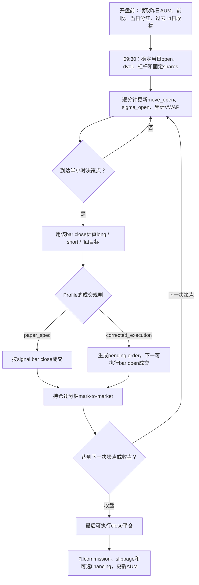

# SPY 日内动量策略：论文交易逻辑与本项目实现详解

**面向读者：** 第一次接触本项目、不了解论文或分钟级回测的人  
**论文：** *Beat the Market: An Effective Intraday Momentum Strategy for S&P500 ETF (SPY)*  
**论文版本：** 2025-09-22 修订版，项目内文件 `Intraday-momentum.pdf`  
**项目实现：** `prepare_spy_data.py` 数据层 + `im_engine_v4.py` 三 profile 引擎  
**数据发布：** `data-v1.0`，明确覆盖 2008-01-22 至 2026-07-09  
**文档性质：** 交易规则与实现说明，不是正式投资建议，也不是 post-publication 经济评价报告

---

## 1. 一句话理解这套策略

这套策略试图判断：

> SPY 当前相对当日开盘的涨跌，是否已经大到超出过去 14 个交易日同一时刻的正常噪声范围，并且是否得到当日累计 VWAP 的确认。

如果价格同时突破“正常噪声上界”和 VWAP，就做多；如果同时跌破“正常噪声下界”和 VWAP，就做空；否则空仓。策略只在每半小时的固定时点重新决策，并在收盘前清空全部仓位，不持有隔夜风险。

论文最后再加入波动率定仓：

- 市场近期波动低时，可以提高名义仓位；
- 市场近期波动高时，自动降低名义仓位；
- 最大杠杆限制为 4 倍；
- 目标日波动率为 2%。

---

## 2. 为什么需要 band 和 VWAP

SPY 在一分钟尺度上存在大量随机波动。价格稍微上涨，并不一定代表出现了持续的买方力量；稍微下跌，也不一定代表卖方占据优势。

论文因此设置两层过滤：

1. **Noise Area / band：** 当前涨跌必须超过过去同一时刻通常会出现的波动；
2. **VWAP：** 当前价格还必须位于当日成交量加权平均价格的同一方向。

可以把它理解为：

```text
band 判断：这次移动是否足够大？
VWAP 判断：当日实际成交重心是否也支持这个方向？
```

只有两者同时确认，才持有方向性仓位。

---

## 3. 数据中的一根一分钟 bar 是什么

每根一分钟 bar 包含：

| 字段 | 含义 |
|---|---|
| `open` | 这一分钟的第一笔或代表性开盘价 |
| `high` | 这一分钟最高价 |
| `low` | 这一分钟最低价 |
| `close` | 这一分钟最后价 |
| `volume` | 这一分钟成交量 |

本项目的数据契约使用 **start-labelled bar**：

```text
09:30 timestamp = 09:30:00 至 09:30:59 这一分钟
09:59 timestamp = 09:59:00 至 09:59:59 这一分钟
```

`minute_of_session` 从 1 开始：

| `minute_of_session` | bar 标签 | bar 结束时刻 |
|---:|---|---|
| 1 | 09:30 | 09:31 |
| 30 | 09:59 | 10:00 |
| 60 | 10:29 | 10:30 |
| 360 | 15:29 | 15:30 |
| 390 | 15:59 | 16:00 |

因此，引擎在 `minute_of_session % 30 == 0` 时决策，对应论文所说的 10:00、10:30、11:00……15:30。16:00 只处理收盘，不允许新开仓。

明确 bar label 很重要。如果把 09:59 bar 错当成“从 09:58 到 09:59”，整个信号和成交时点会错一分钟。

---

## 4. 第一步：计算过去每一天相对开盘的移动

对于历史交易日 \(t-i\) 和某个固定时刻 \(m\)，论文定义：

\[
\operatorname{move}_{t-i,m}
=
\left|
\frac{C_{t-i,m}}{O_{t-i}}-1
\right|
\]

其中：

- \(C_{t-i,m}\)：历史日 \(t-i\) 在时刻 \(m\) 的 close；
- \(O_{t-i}\)：历史日 \(t-i\) 的真实开盘价；
- 绝对值表示这里只关心移动幅度，不区分上涨或下跌。

例如，某天开盘是 500，10:30 close 是 502：

\[
\left|\frac{502}{500}-1\right|=0.4\%
\]

如果另一天下跌到 498：

\[
\left|\frac{498}{500}-1\right|=0.4\%
\]

两天都贡献 0.4% 的历史噪声观察。

当前代码在 `im_engine_v4.build_features()` 中按每日第一根 bar 建立 `open_day`，再计算：

```python
move_open = abs(close / open_day - 1)
```

但只有 `move_open_obs_valid=True` 的观察才能进入历史。一个开盘数据缺失的交易日，即使下午还有价格，也不能把下午第一根可得 bar 冒充真实开盘。

---

## 5. 第二步：计算同一时刻过去 14 日的平均噪声

论文在每个时刻 \(m\) 单独计算：

\[
\sigma_{t,m}
=
\frac{1}{14}
\sum_{i=1}^{14}
\operatorname{move}_{t-i,m}
\]

这里的 \(\sigma_{t,m}\) 不是传统意义上的标准差，而是：

> 过去 14 个交易日，在同一时刻相对开盘的绝对移动平均值。

每个时刻有自己的 \(\sigma\)：

- 10:00 使用过去 14 个交易日的 10:00 观察；
- 12:30 使用过去 14 个交易日的 12:30 观察；
- 15:30 使用过去 14 个交易日的 15:30 观察。

通常越接近收盘，相对开盘的累计移动越大，因此 band 会随时间动态变化。

### 5.1 本项目的严格窗口

`paper_spec` 和 `corrected_execution` 使用严格的 14-session 窗口：

- 当前日不进入窗口；
- 只使用之前的交易日；
- 某日该 minute 缺失时，NaN 仍占据窗口槽位；
- 不向前寻找第 15 个、更老的有效观察来补足；
- 半日市未安排的下午 minute 不算“缺失”，该交易日本来就不是该 minute 的 eligible session；
- halt minute 不是正常观察，也不能进入后续 `sigma_open` 历史。

这避免把“过去 14 个交易日”静默改成“最近 14 个碰巧存在的数据行”。

### 5.2 作者 sample 的差异

作者公开 Python sample 使用：

```python
rolling(window=14, min_periods=13).mean().shift(1)
```

所以只要 13 个有效值就可能开始交易。项目把这个行为保留在：

```text
official_sample_compatible
```

但 `paper_spec` 按论文文字要求完整 14 个历史观察。

---

## 6. 第三步：构造动态 Noise Area / band

论文原始公式为：

\[
UB_{t,m}
=
\max(O_t,C_{t-1})
\times
(1+\sigma_{t,m})
\]

\[
LB_{t,m}
=
\min(O_t,C_{t-1})
\times
(1-\sigma_{t,m})
\]

其中：

- \(O_t\)：当日开盘价；
- \(C_{t-1}\)：前一交易日收盘价；
- \(UB\)：upper band；
- \(LB\)：lower band。

使用 `max()` 和 `min()` 的目的是把隔夜 gap 纳入噪声区间。

### 6.1 Gap-up

如果：

```text
昨日收盘 = 500
今日开盘 = 505
```

则：

```text
upper anchor = max(505, 500) = 505
lower anchor = min(505, 500) = 500
```

下界仍以昨日收盘为锚，避免仅凭隔夜高开就过早认定当日日内出现新的下行或上行动量。

### 6.2 Gap-down

如果：

```text
昨日收盘 = 500
今日开盘 = 495
```

则：

```text
upper anchor = 500
lower anchor = 495
```

上界保留昨日收盘锚点，把隔夜下跳包含在 Noise Area 中。

### 6.3 本项目的现金分红调整

当前项目实际使用：

\[
C_{t-1}^{adj}=C_{t-1}-D_t
\]

\[
UB_{t,m}
=
\max(O_t,C_{t-1}^{adj})
\times
(1+k\sigma_{t,m})
\]

\[
LB_{t,m}
=
\min(O_t,C_{t-1}^{adj})
\times
(1-k\sigma_{t,m})
\]

其中：

- \(D_t\)：当日 ex-date 的每股现金分红；
- \(k\)：`band_mult`，论文和默认实现均为 1。

这一步没有改写原始 OHLC，只调整策略使用的前收锚点。

需要特别说明：

- 论文 PDF 的 band 公式只写 \(C_{t-1}\)，正文没有明确讨论 dividend；
- 作者公开 Python sample 会从前收中减去当日分红；
- 当前 `paper_spec` 跟随作者代码的除息处理；
- 因此“分红调整”是作者代码意图与经济合理性支持的实现，不是论文正文逐字写出的规则。

如果不调整分红，除息日机械价格下移可能被误认为真实卖压。

---

## 7. 第四步：计算当日累计 VWAP

VWAP 是 Volume Weighted Average Price，即成交量加权平均价格。

论文明确 VWAP 只使用正常市场时段数据，但没有在正文中规定一分钟 bar 应使用 HLC3、OHLC4 还是成交级 VWAP。

作者 Python sample 和本项目默认都使用 HLC3：

\[
P_u^{HLC3}
=
\frac{H_u+L_u+C_u}{3}
\]

\[
VWAP_{t,m}
=
\frac{
\sum_{u=1}^{m}V_{t,u}P_{t,u}^{HLC3}
}{
\sum_{u=1}^{m}V_{t,u}
}
\]

这是一条从开盘开始、逐分钟累积的曲线，不是数据商提供的“单根 bar VWAP”。

### 7.1 为什么不能把 vendor bar VWAP 直接当累计 VWAP

单根 bar VWAP 只表示这一分钟内部的成交均价。论文策略使用的是：

```text
从开盘到当前时刻的累计成交重心
```

因此即使选择 `vendor_bar_vwap` 作为每根 bar 的价格代理，仍要用每分钟 volume 再做当日累计。

### 7.2 缺失 minute

如果 11:19 缺少一根正常应交易的 bar：

- 11:18 之前的 VWAP 仍可信；
- 11:19 开始累计路径不完整；
- 11:19 之后 `vwap_valid=False`；
- 不能用 forward fill 制造不存在的价格和成交量。

### 7.3 Halt

官方 halt minute 本来就没有正常连续成交，因此：

- halt minute 不参与累计成交量和累计 PV；
- vendor 即使保留零量 phantom bar，也不能把它当有效观察；
- halt 本身不会像普通数据缺失那样永久破坏复牌后的 VWAP；
- halt 内不允许产生信号或成交。

---

## 8. 第五步：生成多头、空头或空仓信号

当前最终信号为：

\[
Signal_{t,m}
=
\begin{cases}
+1, & C_{t,m}>UB_{t,m}\ \text{且}\ C_{t,m}>VWAP_{t,m}\\
-1, & C_{t,m}<LB_{t,m}\ \text{且}\ C_{t,m}<VWAP_{t,m}\\
0, & \text{其他情况}
\end{cases}
\]

也可以写成：

```text
close > max(upper_band, VWAP)  → long
close < min(lower_band, VWAP)  → short
其他                            → flat
```

### 8.1 为什么 `0` 很重要

`0` 不只是“没有新信号”，而是目标仓位为空仓。

例如已经持有多仓，下一决策点出现：

```text
close 仍高于 VWAP
但已经跌回 upper band 下方
```

此时信号变为0，引擎平掉多仓。

### 8.2 反手

如果多仓状态下，下一决策点直接满足空头条件：

```text
+1 → -1
```

这不是一单位成交，而是：

```text
卖出 N 股平多
再卖出 N 股建立空仓
合计交易 2N 股
```

因此 `0 → +1 → -1 → 0` 共计4个 traded units：

1. 开多：1；
2. 多翻空：2；
3. 平空：1。

---

## 9. 第六步：每日波动率与仓位大小

论文使用过去14个日收益的样本标准差：

\[
\mu_t
=
\frac{1}{14}
\sum_{i=1}^{14}r_{t-i}
\]

\[
\sigma^{daily}_t
=
\sqrt{
\frac{1}{13}
\sum_{i=1}^{14}
(r_{t-i}-\mu_t)^2
}
\]

分母是13，因此这是14个观察的样本标准差。

目标杠杆：

\[
L_t
=
\min
\left(
4,
\frac{0.02}{\sigma^{daily}_t}
\right)
\]

每日股数：

\[
Shares_t
=
\left\lfloor
\frac{
AUM_{t-1}\times L_t
}{
O_t
}
\right\rfloor
\]

其中：

- \(AUM_{t-1}\)：前一交易日结束后的账户权益；
- \(0.02\)：2%日波动目标；
- 4：最高4倍杠杆；
- floor 表示向下取整。

### 9.1 数值例子

假设：

```text
昨日 AUM = $100,000
今日开盘 = $500
过去14日样本波动率 = 1%
```

则：

\[
L_t=\min(4,2\%/1\%)=2
\]

\[
Shares_t
=
\left\lfloor
\frac{100000\times2}{500}
\right\rfloor
=400
\]

如果波动率升到4%：

\[
L_t=2\%/4\%=0.5
\]

\[
Shares_t=100
\]

所以同样的账户，在高波动环境下自动降低持仓。

### 9.2 历史窗口不能使用当天收益

在交易日 \(t\) 开盘时，当日收盘收益还不存在，因此只能使用：

```text
t-1 至 t-14
```

`dvol_lag=0` 会使用未来信息，当前引擎直接拒绝。

作者 sample 实际使用了 `d-15..d-2`，漏掉最近完成的 \(t-1\) 收益。本项目只在 `official_sample_compatible` 中保留这个偏差；`paper_spec` 和 `corrected_execution` 使用正确的 \(t-1..t-14\) 窗口。

### 9.3 波动率缺失

作者 sample 在波动率为 NaN 时使用最大4倍杠杆。这意味着“最不知道风险的时候承担最大风险”。

当前处理：

| Profile | 波动率缺失时 |
|---|---|
| `official_sample_compatible` | 保留作者行为，使用4× |
| `paper_spec` | 不交易 |
| `corrected_execution` | 不交易 |

---

## 10. 完整的日内交易时间线

下面以正常完整交易日为例：



### 10.1 决策与成交不是同一件事

策略需要当前 bar 的 close、band 和累计 VWAP，所以信号最早只能在该 bar 结束后确认。

本项目显式区分：

```text
signal time
→ order
→ intended fill time
→ actual fill
→ filled position
→ PnL
```

这比简单使用 `position.shift(1) * close.diff()` 更容易审计。

---

## 11. 三个 profile 分别回答什么问题

### 11.1 `official_sample_compatible`

目标：

> 解释作者公开 Python notebook 的结果是如何产生的。

保留的作者 sample 约定包括：

- `sigma_open` 有13个值即可 warm-up；
- 日波动率使用 `d-15..d-2`；
- NaN volatility 使用4倍杠杆；
- 股数使用 `round()`；
- 不扣论文的 `$0.001/share` slippage；
- 在实际存在的数据行上 rolling；
- exposure 按数据行 shift 后计算 close-to-close PnL。

它不是逐行 bit parity：

- 当前项目仍使用自己的交易日历；
- 数据源不同；
- tier 和缺失数据处理不同；
- AUM 时间轴更严格。

因此它只能称为 **convention parity**。

### 11.2 `paper_spec`

目标：

> 尽量按论文文字和作者明确意图复现策略信号与成本。

主要规则：

- 严格14个历史 eligible sessions；
- `band_mult=1`；
- 2%日波动目标；
- 最大4倍杠杆；
- floor 股数；
- `$0.0035/share` commission；
- `$0.001/share` slippage；
- 分红调整前收；
- signal-bar-close 成交约定。

需要谨慎理解：

- 分红调整来自作者 sample，论文正文未写明；
- HLC3 VWAP 来自作者 sample，论文正文只规定 market-hours VWAP；
- `$0.35/order` 最低佣金来自作者 sample/券商约定，论文正文只写每股费率；
- signal-bar-close 是对论文模糊成交描述的一种解释，不是原文唯一可能解释。

所以 `paper_spec` 是“可归因的论文复现 profile”，不是声称论文把所有工程细节都写全了。

### 11.3 `corrected_execution`

目标：

> 保留论文信号，但更诚实地模拟现实中能够成交的路径。

相对 `paper_spec` 的主要变化：

- 信号在 bar close 确认；
- 下一可执行 bar open 才成交；
- 默认执行滑点提高到 `$0.005/share`；
- 真实 pending-order 状态；
- 信号后的预定成交 minute 不可用时，默认取消订单；
- 可选择 queue 到复牌成交；
- 未成交订单不能获得复牌 gap；
- 已有持仓必须承担完整复牌 gap。

它是当前最接近经济结果的 profile，但仍不是完整实盘模型，因为：

- market impact 尚未完整建模；
- 融资和借券 time-integral 尚未完成；
- 没有排队位置模型；
- 固定每股滑点无法表达大订单参与率；
- 独立 daily benchmark 尚未接入。

---

## 12. 成交状态机如何工作

### 12.1 `paper_spec`

如果决策点目标仓位变化：

```text
当前bar close确认信号
→ 同一close价格执行目标仓位
```

这是论文复现约定，较为乐观。

### 12.2 `corrected_execution`

如果在 minute \(m\) 的 bar close 产生信号：

```text
pending target = signal
pending due = m + exec_lag_minutes
```

默认 `exec_lag_minutes=1`。

到下一个 minute：

- 如果该 minute 可执行：按 open 成交；
- 如果预定 minute 不可执行，且 policy 是 cancel：取消；
- 如果 policy 是 queue：等到第一个可执行 minute，按其 open 成交。

### 12.3 PnL归属

成交前的价格变化属于旧仓位。

例如：

```text
旧仓位 = 多头
下一bar open发生向下gap
随后在该open平仓
```

这个 gap 必须计入旧多仓，因为持仓者承担了风险。

相反，如果上一 bar 只产生了多头信号、尚未成交：

```text
复牌前没有仓位
→ 复牌gap不属于该订单
→ 在复牌open成交后才开始计算PnL
```

---

## 13. Halt / 熔断的处理

论文没有给出完整的 halt 状态机。本项目采用以下明确规则：

| 情况 | 是否承担复牌 gap |
|---|---|
| halt前已经持仓 | 是 |
| halt前产生信号，但订单到期时不可成交并被取消 | 否 |
| 订单选择queue到复牌 | 成交前否；复牌价成交后开始 |
| halt内出现计算上的方向条件 | 不允许决策 |

关键原则：

> “没有成交”不等于“已经持仓”；“halt期间没有bar”也不等于持仓没有风险。

当前数据层还会验证官方 halt minute 集合，防止：

- vendor 在 halt 内保留 phantom bar；
- halt 外缺失同样数量的正常 bar；
- 两者数量抵消后被错误判断为完整交易日。

---

## 14. 日终退出与未知退出

### 14.1 正常收盘

论文要求所有持仓在 market close 平掉，不留隔夜仓位。

正常完整交易日中：

- 15:59 start-labelled bar 在16:00结束；
- 现有仓位按最后可执行 close 平仓；
- EOD flatten 计入成交量和成本；
- 最后一根 bar 不允许新开仓或反手。

否则可能出现：

```text
16:00刚开仓
→ 同价立即平仓
→ PnL为0
→ 却扣两次成本
```

### 14.2 尾盘缺失

如果数据只到14:30，而策略仍持仓：

- 最后一根可得价格不等于真实收盘；
- 不能虚构16:00退出价；
- 该日标记为 `unknown_exit`。

默认 policy 是 `terminate`：

- 当日不进入 headline return；
- 猜测的退出PnL不进入AUM；
- 后续权益曲线停止，避免错误AUM继续影响未来股数。

其他 policy 只用于明确标记的敏感性分析。

---

## 15. 成本与账户核算

### 15.1 Gross PnL

每一段持仓的毛损益为：

\[
GrossPnL
=
Position
\times
(P_{new}-P_{old})
\times
Shares
\]

其中：

- 多仓 `Position=+1`；
- 空仓 `Position=-1`；
- 只有已经成交的仓位才产生 PnL。

### 15.2 Commission

每张订单：

\[
Commission
=
\max(
MinimumCommission,
CommissionPerShare\times Quantity
)
\]

默认：

```text
commission/share = $0.0035
minimum/order = $0.35
```

最低佣金是否在反手时收一次或两次，由 `reversal_order_model` 控制。

### 15.3 Slippage

\[
Slippage
=
SlipPerShare\times Quantity
\]

slippage 与 commission 分开累计，最低佣金不能吞掉 slippage。

默认值：

| Profile | Slippage/share |
|---|---:|
| `official_sample_compatible` | $0 |
| `paper_spec` | $0.001 |
| `corrected_execution` | $0.005 |

### 15.4 每日会计恒等式

\[
NetPnL
=
GrossPnL
-Commission
-Slippage
+CashInterest
-FundingCost
-BorrowCost
\]

\[
AUM_t=AUM_{t-1}+NetPnL_t
\]

当前正式 mechanics baseline 中现金、融资和借券 rate 默认均为0。

现有融资接口仍是近似版本。正式经济评价前，需要分别累计：

```text
positive_cash_time_integral
borrowed_cash_time_integral
long_notional_time_integral
short_notional_time_integral
```

不能用 `avg_signed_notional` 让同一天先多后空的风险相互抵消。

---

## 16. 为什么数据有效性是交易逻辑的一部分

一分钟策略中，数据缺失会改变信号定义，而不只是减少样本数量。

### 16.1 不能先删除坏日再计算特征

错误流程：

```text
只保留paper_ready交易日
→ 再计算previous close和14日rolling
```

这会造成：

- 次日 previous close 跨过被删除的交易日；
- 14日窗口变成“14个保留日”；
- 自然时间跨度被改变；
- 坏日的有效收盘无法用于次日前收；
- 缺失观察不再占窗口槽位。

正确流程：

```text
完整XNYS交易日历
→ 清洗后的全部有效bar
→ 组件级validity
→ 全日历历史特征
→ 配置相关signal mask
→ 最后应用session tier
```

### 16.2 核心 validity 字段

| 字段 | 含义 |
|---|---|
| `bar_present` | 计划中的该 minute 是否真的存在bar |
| `open_valid` | 当日真实开盘锚点是否存在且可信 |
| `close_valid` | 最后计划 minute 是否存在且可信 |
| `prev_close_valid` | 当日使用的前一交易日close是否可信 |
| `daily_ret_valid` | close-to-close日收益两端是否都有效 |
| `move_open_obs_valid` | 当日open和当前非halt bar是否都有效 |
| `vwap_valid` | 从开盘到当前minute的累计VWAP路径是否完整 |
| `is_halt_minute` | 是否属于官方halt |
| `is_executable_minute` | 当前minute是否真实可成交 |
| `sigma_history_valid` | 同minute历史窗口是否满足当前配置 |

### 16.3 一个 interior gap 的不同影响

假设11:19缺失：

```text
12:00 close存在
真实09:30 open存在
```

则：

- 12:00 `move_open` 仍能计算；
- 但11:19之后累计VWAP缺少成交量和价格路径；
- 因此12:00 `move_open_obs_valid=True`；
- 12:00 `vwap_valid=False`。

这说明不能用一个简单的“当天有效/无效”flag概括所有特征。

---

## 17. 三个 session tier

| Tier | 定位 | 应如何使用 |
|---|---|---|
| `paper_ready` | 所有计划分钟完整 | 论文完整数据基准和 sample convention 对照 |
| `halt_aware` | 完整日 + 只有官方halt分钟缺失的交易日 | 当前主要经济口径 |
| `exploratory` | 允许有限数据缺口 | 仅敏感性分析 |

每个 tier 都是一条不同的权益曲线。必须分别报告完整的：

- Total Return；
- CAGR；
- Volatility；
- Sharpe；
- MDD；
- Worst Day；
- Skew；
- Turnover；
- 成本。

不能使用：

```text
paper_ready的CAGR / halt_aware的MDD
```

因为这个 Calmar 比率不属于任何真实权益曲线。

---

## 18. 一个完整但简化的信号例子

以下数字只是教学例子，不是真实市场记录。

假设某日：

```text
当日open                         = 500.00
昨日close                       = 502.00
当日现金分红                    =   1.00
调整后previous close            = 501.00
过去14日该时刻平均move_open     =   0.30%
当前累计VWAP                    = 501.20
当前close                       = 502.70
```

Band：

\[
UB
=
\max(500,501)\times(1+0.003)
=502.503
\]

\[
LB
=
\min(500,501)\times(1-0.003)
=498.50
\]

当前 close：

```text
502.70 > upper band 502.503
502.70 > VWAP 501.20
```

所以：

```text
signal = +1
```

如果昨日AUM为 `$100,000`、过去14日样本波动率为1%，则：

```text
leverage = 2
shares = floor(100,000 × 2 / 500) = 400
```

在 `paper_spec` 中，目标是按信号 bar close 建立400股多仓。

在 `corrected_execution` 中：

```text
当前bar close产生long信号
→ 下一可执行bar open买入400股
→ 从实际成交价以后开始计算多仓PnL
```

---

## 19. 回测主循环的伪代码

```python
for day in complete_exchange_calendar:
    read previous_aum
    read day_open
    read adjusted_previous_close

    dvol = sample_std(previous_14_valid_daily_returns)
    if dvol is invalid:
        apply profile-specific nan-vol policy
    else:
        leverage = min(4, 0.02 / dvol)

    shares = floor(previous_aum * leverage / day_open)

    for minute in scheduled_minutes:
        compute move_open
        compute same-minute sigma_open from prior eligible sessions
        update cumulative VWAP

        if minute is a valid 30-minute decision:
            if close > upper_band and close > vwap:
                target = +1
            elif close < lower_band and close < vwap:
                target = -1
            else:
                target = 0

            route target through profile-specific execution

        mark the already-filled position to the next actual price

    flatten any known position at the scheduled close
    compute gross, commission, slippage and financing
    update AUM only with known net PnL
```

---

## 20. 论文、作者 sample 与当前实现的关键差异

| 项目 | 论文正文 | 作者 Python sample | `paper_spec` / 当前严格实现 |
|---|---|---|---|
| 同minute窗口 | 14日 | 13个值即可 | 严格14个eligible sessions |
| 日波动窗口 | 最近完成14日 | 漏掉最近一天 | 使用 \(t-1..t-14\) |
| NaN volatility | 未明确 | 4× | 不交易 |
| 前收分红调整 | 正文未明确 | 减当日分红 | 减当日分红并记录来源 |
| VWAP价格代理 | 未明确 | HLC3 | 默认HLC3，可显式配置 |
| 交易频率 | HH:00/HH:30 | 每30个 `min_from_open` | start-labelled grid每30分钟 |
| 成交口径 | 描述存在解释空间 | shifted close exposure | paper按signal close；corrected按next open |
| 股数 | floor | round | paper floor；sample round |
| Commission | `$0.0035/share` | 加`$0.35/order`最低值 | 两者都计 |
| Slippage | `$0.001/share` | 代码通常未扣 | paper明确扣0.001 |
| 缺失数据 | 未系统说明 | 现有行rolling | 完整calendar、缺失占槽位 |
| Halt | 未系统说明 | 无状态机 | 显式order/fill和复牌gap |
| Benchmark | SPY Buy&Hold | 通常price return | 同时报price/total，经济比较以total为主 |

---

## 21. Benchmark 与策略收益不是同一件事

策略收益回答：

> 交易规则本身赚了多少？

Benchmark 回答：

> 与长期持有SPY相比，是否有超额收益？

当前引擎计算：

- SPY price return；
- SPY total return；
- excess CAGR；
- beta；
- annualised alpha；
- information ratio。

处理原则：

- invalid close 是 NaN，不能用最后可得bar冒充收盘；
- evaluation首日前增加一个有效close anchor；
- `pct_change(fill_method=None)`，不自动填补；
- strategy和benchmark使用相同session时间轴；
- benchmark total return使用同一分红文件。

论文表中的 SPY Buy&Hold 更接近 raw-price benchmark。当前经济比较以 total return 为主要基准，因此 benchmark、alpha和excess不应直接宣称与论文表格逐项相同。

正式报告仍建议接入独立 daily SPY raw-close 数据，因为分钟文件若缺少真实尾盘，无法恢复当天真正的收盘价。

---

## 22. 统计指标如何解释

### Total Return

\[
TotalReturn
=
\prod_t(1+r_t)-1
\]

### CAGR

按首末实际日期的年数计算，而不是用保留下来的收益行数假设经过了多少年。

### Volatility

完整evaluation session日收益的样本标准差乘 \(\sqrt{252}\)。

### Sharpe

\[
Sharpe
=
\frac{
\overline r-r_f/252
}{
s_r
}
\sqrt{252}
\]

主指标是 `Sharpe_calendar`。没有仓位或没有信号的交易日仍留在日历时间轴上。

不能只选择有交易的日收益再直接乘 \(\sqrt{252}\)，否则会机械抬高 Sharpe。

### Maximum Drawdown

从同一条复利权益曲线计算峰值到后续谷值的最大跌幅。

### Hit Ratio

当前 headline `Hit%` 是非零日收益中正收益日的比例。论文另有 trade-level hit ratio，两者不能混用。

---

## 23. 当前验证证据

截至本文编写时，项目记录的验证包括：

- `python test_engine.py`：62项引擎检查；
- `python prepare_spy_data.py --self-test`：28项数据层检查；
- 不可变 `data-v1.0` 与普通pipeline run的等价加载检查；
- halt持仓与未成交订单的复牌gap测试；
- 反手quantity、commission和slippage测试；
- 14-session warm-up和缺失slot测试；
- dividend band adjustment测试；
- `trade_freq`、`sigma_window`、`use_vwap`、`sizing`参数真实生效测试；
- final-bar round-trip防护；
- unknown exit不污染AUM；
- benchmark首日anchor和invalid close处理；
- Cfg字段使用审计，防止参数只声明但未被代码读取。

论文Q24独立复现实验运行：

```text
3 profiles
× 3 tiers
× 2 dividend modes
= 18 cells
```

其中：

```text
paper_spec × halt_aware × with_dividends
```

在严格可比的206个月中，月收益平均绝对误差为0.3059个百分点；忽略分红时为0.3539个百分点。这个结果支持当前 band 分红调整和 halt-aware 口径，但不能证明逐行 bit parity：

- 当前数据源不是论文的IQFeed；
- 当前数据从2008-01-22开始，论文从2007年5月开始；
- primary组合是在初步观察后登记的诊断组合，不是盲预注册；
- 部分月份仍存在明显差异。

该实验只用于论文复现诊断，不是正式 post-publication 经济评价。

---

## 24. 当前实现仍然缺少什么

即使 `corrected_execution` 比论文回测更现实，也仍然不是完整实盘模拟。

尚未完成：

1. 完整signals / orders / fills / round-trip ledger；
2. 正现金、借入现金、多头notional、空头notional的独立time-integral；
3. 完整融资和short borrow成本；
4. 依订单规模、ADV、波动率和参与率变化的market impact；
5. 排队位置和部分成交模型；
6. 独立daily SPY raw-close benchmark；
7. 唯一的可执行evaluation runner；
8. bootstrap/HAC等统计不确定性；
9. 冻结后的唯一post-publication正式报告。

因此：

> `corrected_execution` 是比论文复现更诚实的历史模拟，但仍应视为完整实盘成本前的上限估计。

---

## 25. 阅读项目结果时应使用哪个组合

### 作者 sample 归因

```text
official_sample_compatible × paper_ready
```

用于理解作者 notebook 的主要约定，不用于实盘结论。

### 论文完整数据复现基准

```text
paper_spec × paper_ready
```

用于回答严格完整分钟数据下的论文规则表现。

### Q24 月收益诊断

```text
paper_spec × halt_aware × with_dividends
```

当前与论文2025-09-22修订版Q24月表最接近，但属于已披露的观察后诊断选择。

### 当前主要经济口径

```text
corrected_execution × halt_aware × with_dividends
```

仍需加入完整融资、借券、market impact和独立benchmark后，才能形成最终经济结论。

---

## 26. 最容易产生误解的十句话

### 误解1：“突破upper band就做多”

不完整。最终策略还要求价格高于VWAP。

### 误解2：“VWAP是vendor提供的每分钟VWAP列”

不正确。策略使用从开盘到当前minute的累计VWAP。

### 误解3：“过去14日就是最近14个有效值”

不正确。缺失观察占槽位，不能向前找更老数据补足。

### 误解4：“没有bar的halt期间没有PnL”

不正确。已有持仓承担复牌gap，只是不虚构halt内逐分钟价格。

### 误解5：“信号出现就已经持仓”

不正确。`corrected_execution` 必须等下一可执行open真实成交。

### 误解6：“反手是一笔一单位交易”

不正确。多翻空或空翻多需要2N股成交量。

### 误解7：“最后一根可得bar就是收盘价”

不正确。尾盘截断时真实收盘未知。

### 误解8：“只删除坏日，不会改变好日结果”

不正确。previous close、14日band和dvol都会被重新定义。

### 误解9：“论文结果等于可实盘结果”

不正确。论文的成交、融资、借券和impact假设仍偏简化。

### 误解10：“全样本CAGR高就说明策略现在有效”

不正确。真正的研究问题是2024-05-01以后：

```text
gross edge per traded share
是否仍高于
execution + financing + borrow + impact cost per traded share
```

---

## 27. 代码与资料导航

| 文件 | 什么时候读 |
|---|---|
| `../Intraday-momentum.pdf` | 查看论文原文、公式、图表和Q24 |
| `PAPER_SAMPLE_CURRENT_COMPARISON_ZH.md` | 逐项查看论文、作者sample和当前实现差异 |
| `README_DATA.md` | 理解数据发布、validity、tier和halt语义 |
| `README_ENGINE.md` | 理解三profile、状态机、成本和统计 |
| `../prepare_spy_data.py` | 数据检查、交易日历、component validity |
| `../im_engine_v4.py` | 特征、信号、定仓、订单、PnL和报告 |
| `../test_engine.py` | 引擎行为的合成回归检查 |
| `../config/evaluation_spec_v1.yml` | 冻结的post-publication评估规则 |
| `../config/data_release_v1.yml` | data-v1.0边界和环境契约 |
| `../experiments/paper_replication_v1/README.md` | Q24月收益独立复现实验 |

关键代码入口：

```text
im_engine_v4.Cfg
im_engine_v4.profile_cfg
im_engine_v4.load_run
im_engine_v4.build_features
im_engine_v4.config_validity
im_engine_v4._session_pnl
im_engine_v4.backtest
im_engine_v4.stats
im_engine_v4.benchmark
im_engine_v4.report
```

---

## 28. 最终总结

论文策略的核心并不复杂：

```text
过去14日同minute平均绝对波动
→ 构造动态upper/lower band
→ 用累计VWAP确认方向
→ 每30分钟决定long / short / flat
→ 用过去14日日波动率确定股数
→ 最大4倍杠杆
→ 收盘全部平仓
```

真正困难的是把每一个词变成不会产生歧义的代码：

```text
“过去14日”如何处理缺失？
“10:30交易”使用哪个bar？
“VWAP”是单bar还是累计？
信号出现但下一minute halt，算不算已经持仓？
尾盘缺失时用什么价格平仓？
反手收多少成交量和成本？
除息日previous close如何定义？
```

本项目的三profile设计正是为了把这些影响拆开：

- `official_sample_compatible` 解释作者代码；
- `paper_spec` 复现论文规则和作者明确意图；
- `corrected_execution` 评估更诚实的可执行结果。

任何结果都必须同时说明：

```text
profile
tier
dividend mode
slippage
data release
code hash
date range
```

否则一个孤立的 CAGR 或 Sharpe 无法说明它代表的是论文复现、作者sample兼容，还是现实化经济结果。
